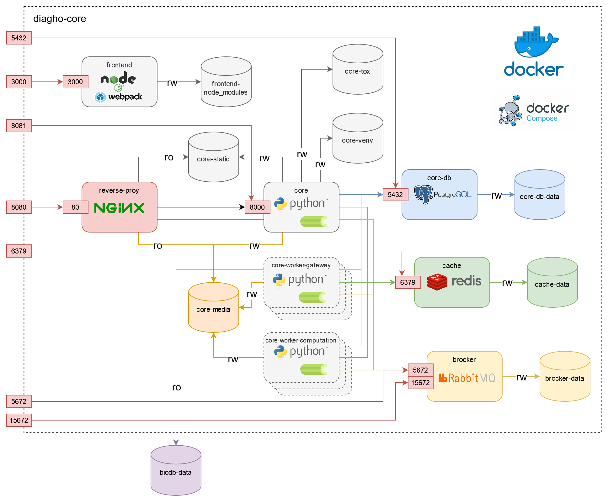

---
hide:
  - toc
---

# diagho-core

The architecture of the __Diagho application__ is based on microservices running with _Docker_ and _Docker Compose_.

A [`docker-compose.dev.yml`](https://github.com/DiaghoProject/diagho-core/blob/main/docker-compose.dev.yml) file is available in the project repository to provide a ready-to-use environment for developers.

Please consult the [`README`](https://github.com/DiaghoProject/diagho-core) file to find out how to get started with your instance of Diagho.

## Microservices architecture

