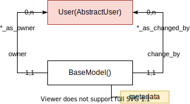
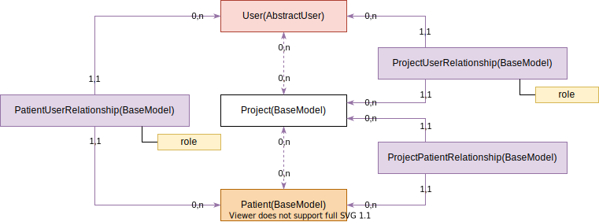
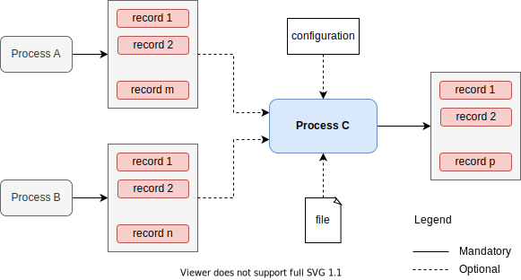
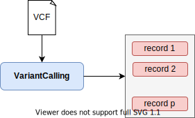
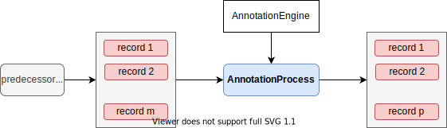
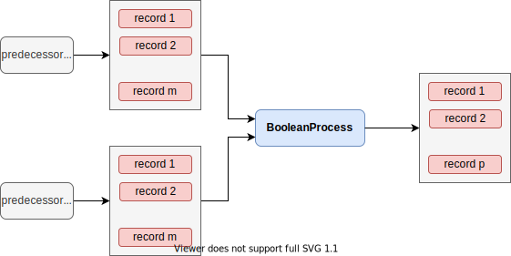
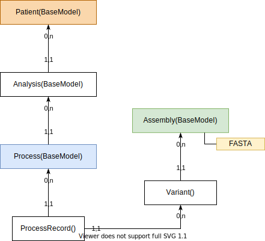
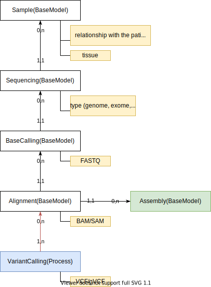
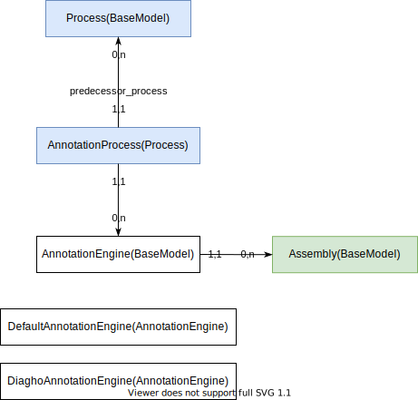
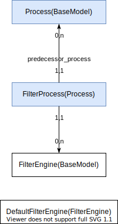

# Interpretation service

!!! attention
    Page obsolète!

!!! link ""
    {: style="width: 20%;" align=left }

    **GitHub**  
    **[DiaghoProject/diagho](https://github.com/DiaghoProject/diagho)**

    Variant Interpretation Service.

## Architecture

## Core

### Django models

#### BaseModel

#### Users / permissions

## Processes

### Description

#### How are the processes connected to each other?

#### Example: VariantCalling Process

#### Example: Annotation Process

#### Example: Filter Process

#### Example: Boolean Processes
- `ConjunctionProcess`
- `DisjunctionProcess`
- `ExclusiveDisjunctionProcess`

### Django models

#### Process base model

#### Variant calling process

#### Annotation process

#### Filter process

