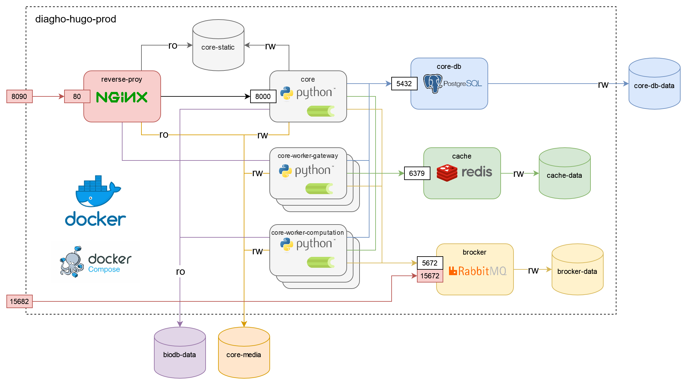

---
hide:
  - toc
---

# Deploy Diagho with Docker Compose

The architecture of the __Diagho application__ is based on microservices running with _Docker_ and _Docker Compose_.

A [`docker-compose.yml`](https://github.com/DiaghoProject/diagho-hugo-prod/blob/main/docker-compose.yml) file is available in the project repository to provide a ready-to-use environment for demo.

## Microservices architecture

