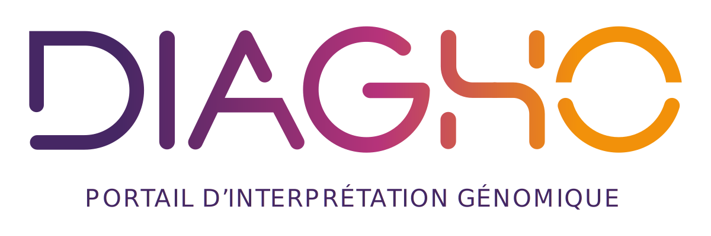
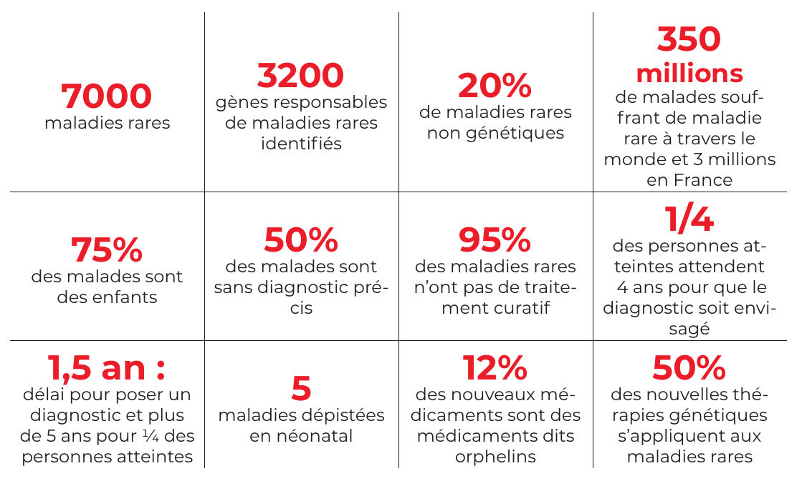

# Home

## Aim

The aim of the Diagho project is to provide software to assist in the interpretation of genomic variations for the diagnosis of rare diseases and then the actionalibility of tumours.

It is estimated that there are almost 8,000 rare diseases (a disease affecting less than one person in 2,000), which together affect 6% of the population, i.e. three million people in France, including ¾ of children under the age of 5.
80% of these diseases are genetic in origin. Today, doctors use high-speed sequencing, i.e. the transcription of patients' DNA into computer files, and the work of geneticists in diagnosing rare diseases consists of mining this data to find the molecular cause (the 'error' in the patient's DNA) causing the disease.[^1]
[^1]: cf [How DNA works](./opensource_docs/newcomers/fondamenteaux/dna.md)

To give an order of magnitude, this involves finding THE relevant line (or a few) in a file of five million lines (30,000 if exome sequencing alone). Due to the difficulty of this task and the fact that there are too few practitioners to cope with the volumes of data generated, the average wait for a diagnosis is 1.5 years in France today (this timeframe still exceeds 5 years for ¼ of patients). Taking all indications together, the diagnostic yield is still only ±50% today, with the molecular cause of certain diseases being almost systematically discovered while others are still rarely understood (a figure to be put into perspective insofar as this 50% was still unimaginable 15 years ago).

Our aim is therefore to provide a tool that simplifies this task as much as possible and assists them as much as possible in making a diagnosis. Any time saved at each stage of their business needs can be reinvested in diagnosing more complex cases.

!!! info ""
    **Diago's fundamental objective is to make life easier for practitioners, simplify the process chain and increase the number of families benefiting from a diagnosis within a shorter timeframe**.

______________________________________________________________________

## To go further

The issues involved in this project are highly complex and specific. In an attempt to make its approach more fluid and less intimidating, the explanation of the subject has been broken down below in a prioritised order to allow a rapid entry into the subject and offer the possibility of a gradual acculturation.

### Fundamentals

- [Application objectives and general functionalities](./opensource_docs/newcomers/autour-de-diagho/objectives.md)
- [Project organisation](./opensource_docs/newcomers/autour-de-diagho/organisation.md)

### How the application works

- [Launch an analysis](./opensource_docs/newcomers/fonctionnement-de-l'appli/analyses.md)
- [Principle of factories](./opensource_docs/newcomers/fonctionnement-de-l'appli/factories.md)

### Around Diagho

Not essential to begin development but can help to understand points often raised in discussion

- [How DNA works](./opensource_docs/newcomers/fondamenteaux/dna.md)
- [Interpretation](./opensource_docs/newcomers/fondamenteaux/interpretation.md)
- [Bioinformatics data processing](./opensource_docs/newcomers/fondamenteaux/bioinformatics.md)
- [Types of variation](./opensource_docs/newcomers/fondamenteaux/variants.md)

### To go further

This goes beyond the scope of the problem, but provides an insight into the wider context of the project.

- [Sequencing process](./opensource_docs/newcomers/pour-aller-plus-loin/sequencing.md)
- [Somatic genetics](./opensource_docs/newcomers/pour-aller-plus-loin/somatic.md)
- [RNAseq](./opensource_docs/newcomers/pour-aller-plus-loin/rnaseq.md)
- [GCS HUGO](./opensource_docs/newcomers/pour-aller-plus-loin/hugo.md)
- [National Context](./opensource_docs/newcomers/pour-aller-plus-loin/national_context.md)
