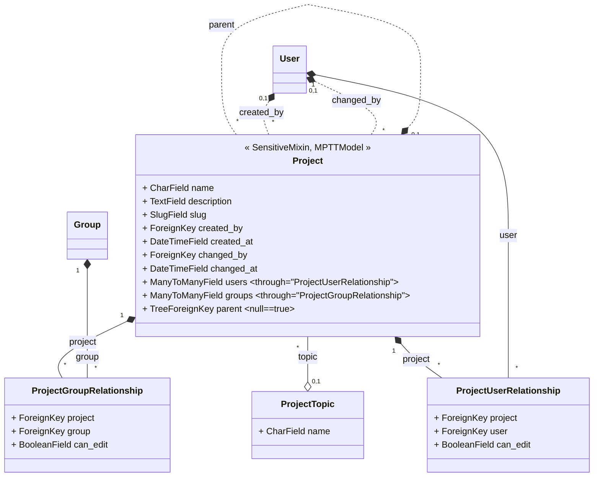

# projects

## data model



## Permissions

Here are the User stories in place for project permissions:

```text
As a user, I can create a new project
As an unauthenticated user, I can not create a new project

As a user, I can get a list of all the projects I am allowed to view
As an unauthenticated user, I can not view projects

As a user, I can list subprojects
As an unauthorized user, I can not list subprojects
As an unauthenticated user, I can not list subprojects

As a user, I can retrieve a project
As an unauthorized user, I can not retrieve a project
As a unauthenticated user, I can not retrieve a project

As a user, I can retrieve a project with level > 1 (sub-subproject)
As an unauthorized user, I can not retrieve a project with level > 1 (sub-subproject)

As a user, I can update a project
As an unauthorized user, I can not update a project
As an unauthenticated user, I can not update a project

As a user, I can list permissions of a project
As a user, I can edit permissions of a project

As a user, I can delete a project
As an unauthorized user, I can not delete a project
As an unauthenticated user, I can not delete a project
```
