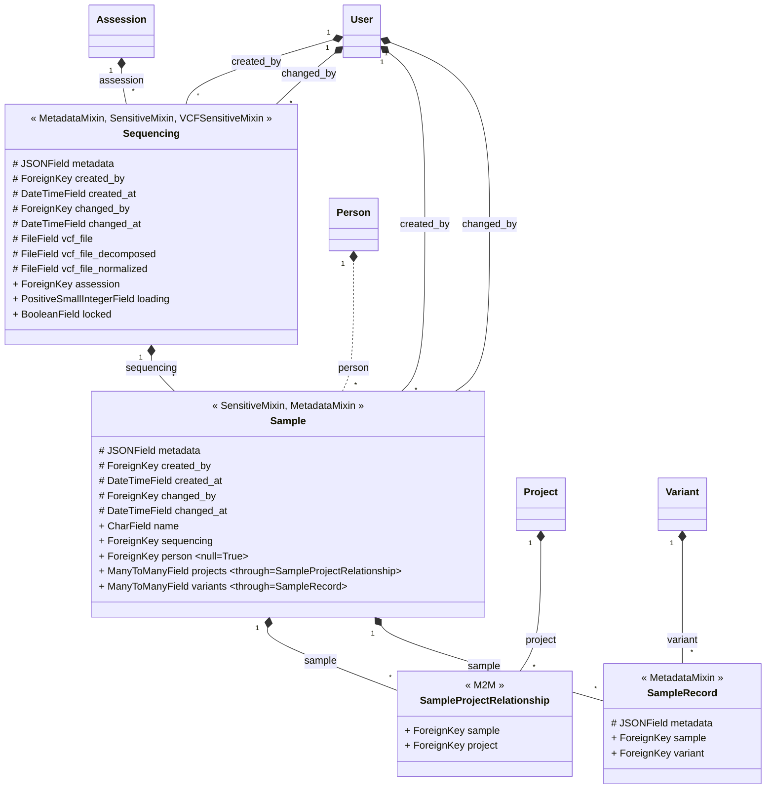

______________________________________________________________________

## hide: - toc

# sequencings

## Parsing

Tool used to parse vcf's: [vt](https://genome.sph.umich.edu/wiki/Vt#VCF_Manipulation)

When a sequencing is added to the db:

- use vt to create a decomposed vcf
  - decomposition creates a biallelic variant out of a multiallelic variant. There is
    a possible loss of information during this process so annotations of former multiallelic variants
    should be recomputed [Source](https://genome.sph.umich.edu/wiki/Vt#Decompose)
- use vt to create a normalized vcf
  - A vcf file is normalized if all its variants are [parsimonious](https://genome.sph.umich.edu/wiki/Variant_Normalization#Definition) (as short as possible without having a length of 0) and [left aligned](https://genome.sph.umich.edu/wiki/Variant_Normalization#Left_alignment) (have no duplicated nucleotides)

## Load

When a sequencing is loaded (Celery chained tasks):

- load samples
  - read the sample names and create the sample db object
- load variants
  - delete all former sample_records (if sequencing has been loaded before)
  - create all contigs and regions present in the vcf as region objects
  - For each contig:
    - load normalized vcf
    - Create a dictionary {sample_name:sample_object}
    - get all variants included in vcf
    - for each variant
      - create variant object
      - for each sample:
        - add variant info to metadata
        - add sample info to metadata field sample
        - remove initial samples field from metadata
        - create samplerecords object

## Storage

Keep original vcf during development phase for traceability.
Once the process is stable, delete original after decomposition.
Keep normalized vcf while sequencing is in db for QC processes

Once a sequencing is deleted, remove all linked vcf's from server

## data model

