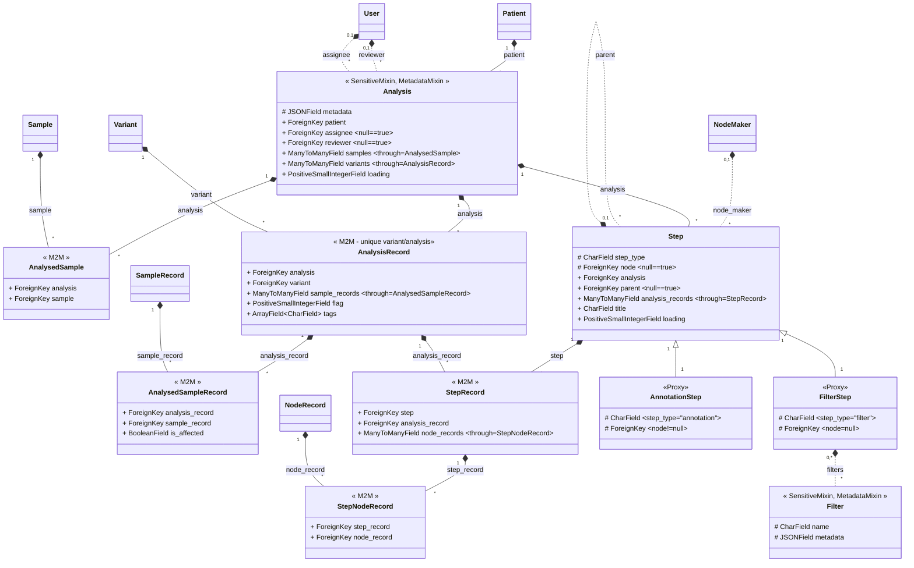

# variant_analyses

## Analysis

A model representing an analysis of genetic data for a given patient, using one or more samples.

An Analysis object holds the metadata for an analysis, including:

- the patient for whom the analysis was conducted,
- the assignee and reviewer assigned to the analysis,
- and the loading state of the samples.

An Analysis object is associated with one or more Sample objects and one or more Variant objects.

## Analysis record

Represents a line of an analysis in the interpretation table.
An AnalysisRecord links together a Variant, an Analysis, and a set of SampleRecords,
and stores notes and flags associated with the analysis results.

- Flag - Variant of interest ("candidate") or irrelevant
- Note - Free textfield for user
- Tags - An array of short strings added by user, representing info associated with this record.

## Loading Samples for an Analysis

When an Analysis is created, samples need to be loaded into it.
This process is done asynchronously to avoid blocking the application.

The `load_samples()` method of the Analysis model is responsible for loading the samples.
It executes the following steps:

1. Sets the loading state to 'started'
2. Deletes any existing AnalysisRecord objects
3. Gets the list of regions with samples and creates subtasks for each region to load its samples
4. Once all subtasks are finished, another subtask is executed to handle the loaded samples

The `handle_samples_loaded()` method of the Analysis model is responsible for handling the loaded samples.
It executes the following steps:

1. Creates analysis columns based on the sample records information and column configuration.
2. Deletes old analysis steps associated with this analysis.
3. Extracts the unique regions from the loaded samples.
4. Builds metadata on each AnalysisRecord (by region), based on the analysis columns.
5. Creates a StepRecord for each AnalysisRecord (by region)
6. Builds the metadata on the StepRecord objects, based on the VCF columns.

## Analysis Columns

**AnalysisColumn**

The AnalysisColumn class represents a column of an analysis.
It contains information about the data source of the column (such as whether it comes from a variant, a sample, or an annotation), the column's width, and whether it is visible or hidden.

**AnalysisColumnConfig**

The AnalysisColumnConfig model is used to configure how the columns will be displayed in *all analyses*.

**ColumnCreator**

The ColumnCreator class is responsible for creating columns in the database for a given Analysis object.
It can create different types of columns based on the source and type of data, using the `AnalysisColumn.add_column()` method.
It takes the first AnalysisRecord object associated with the analysis to retrieve sample records metadata and patient sample metadata.

**ColumnTypes**

Definition of the type of data found under the specified column. Can be of type:

- bool
- date
- float
- integer
- list
- string

The process of defining a columns datatype is broken up into two separate steps: Detection and Assignment

Detection (when the Sequencing is charged):

The column type detection happens during the creation of the samplerecords and the result is stored in the samples "columntypes" field. Here, the standard python types are used + a detection for datetime strings in iso format.

Assignment (when the Analysis is created):

During the actual creation of the columns, the samples columntypes field is used as reference to assign the correct columntypes defined in the variant_analyses.columntype table.

## data model

