______________________________________________________________________

## hide: - toc

!!! note
Tour du propriétaire mené par Manuel. Étant un outil propriétaire, il sera compliqué de récupérer beaucoup d'autres informations ou plus récentes.\
On retrouve cependant beaucoup de features discutées et intéressantes.

## Interface

=== "Analyses"

```
[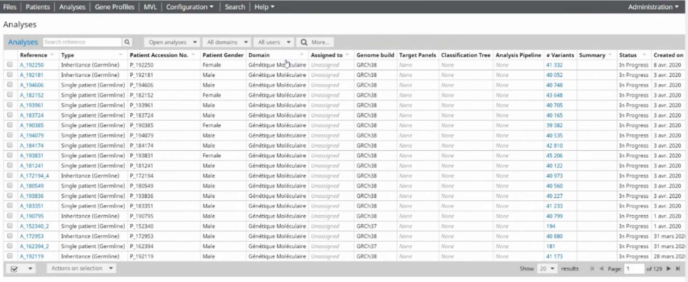{ loading=lazy }](./images/alissa/analyses.jpg)
```

=== "Patient"

```
[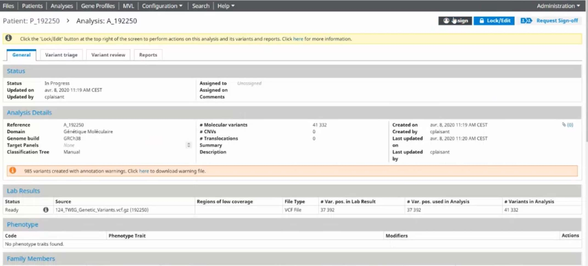{ loading=lazy }](./images/alissa/analysishome.jpg)
[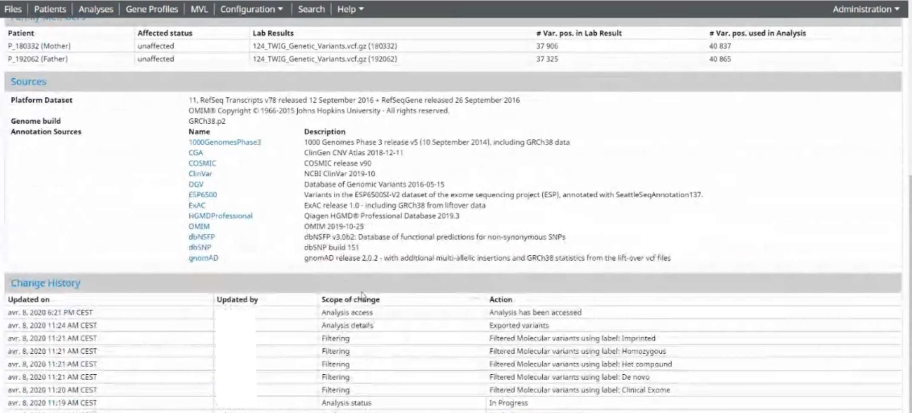{ loading=lazy }](./images/alissa/analysishome2.jpg)
```

=== "Tableau"

```
=== "Base"

    [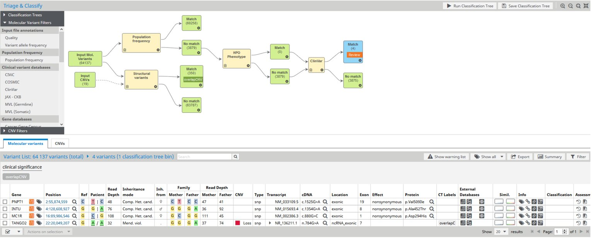{ loading=lazy }](./images/alissa/table.jpg)

=== "SNV"

    [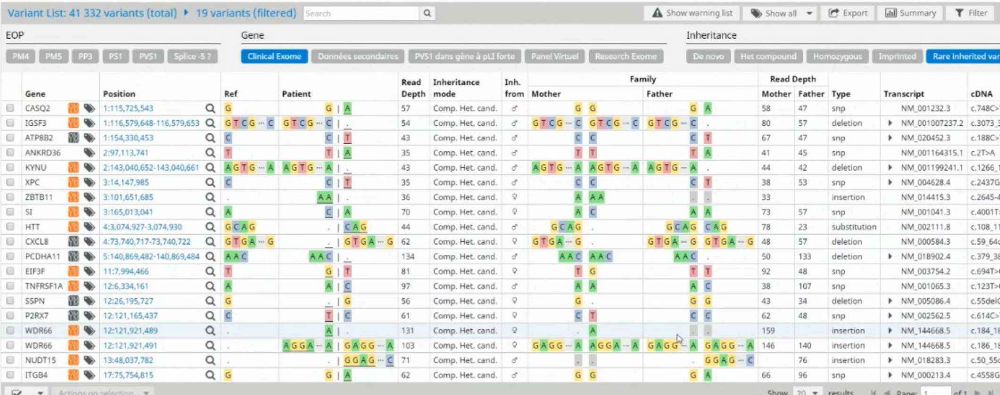{ loading=lazy }](./images/alissa/table2.jpg)

=== "CNV"

    [{ loading=lazy }](./images/alissa/cnvtable.jpg)

=== "Accordéon variation"

    [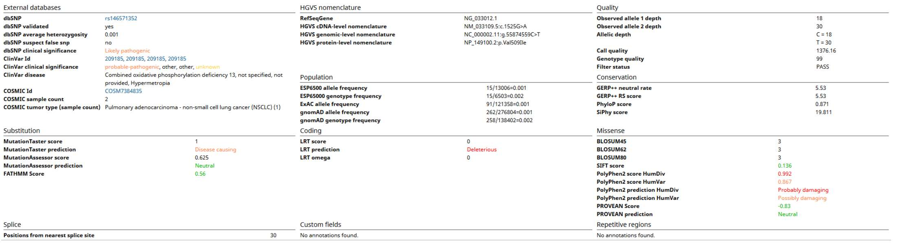{ loading=lazy }](./images/alissa/varannotation.jpg)

=== "Accordéon gène"

    [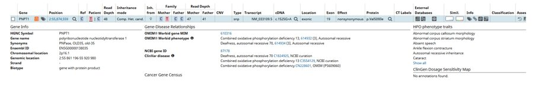{ loading=lazy }](./images/alissa/collapsible.jpg)
```

=== "Filtres"

```
=== "Filtres rapides"

    [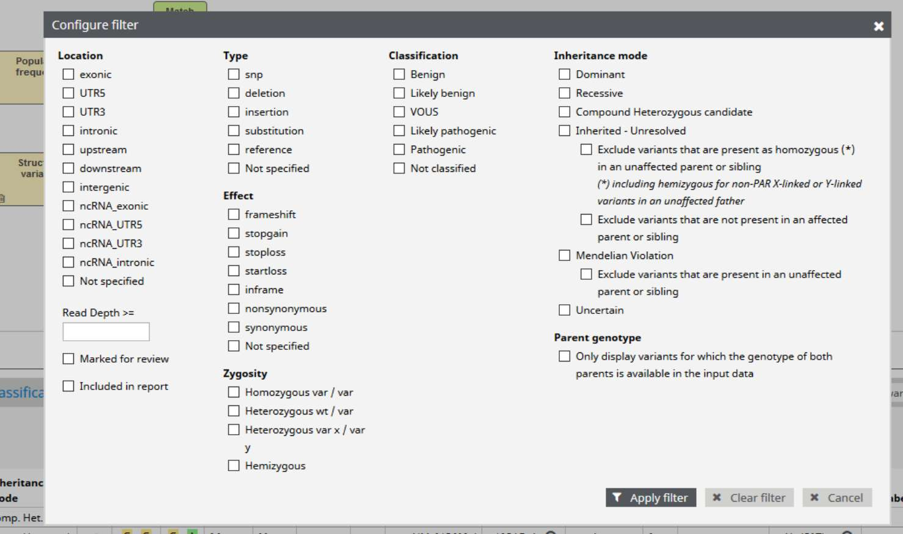{ loading=lazy }](./images/alissa/quickfilters.jpg)

=== "Graphe"

    [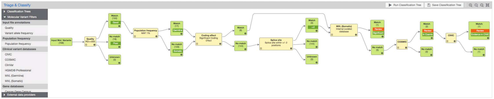{ loading=lazy }](./images/alissa/graphe.jpg)

=== "Graphe 2"

    [{ loading=lazy }](./images/alissa/largegraph.jpg)

=== "Use case"

    [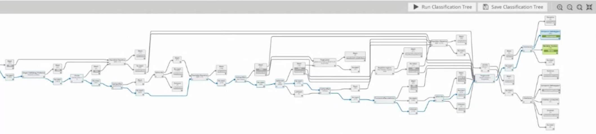{ loading=lazy }](./images/alissa/grapheexample.jpg)

=== "Config nœud 1"

    [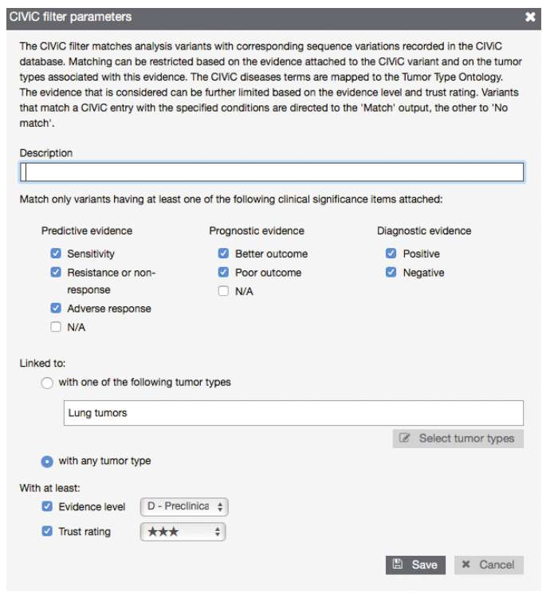{ loading=lazy }](./images/alissa/formfilter.jpg)

=== "Config nœud 2"

    [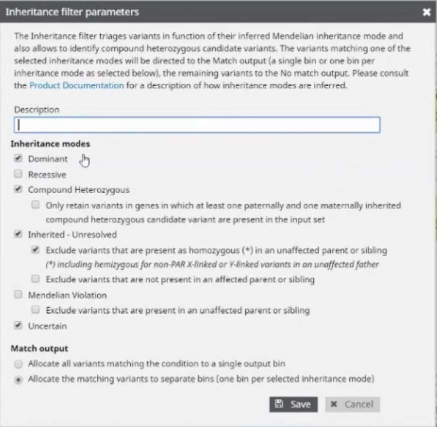{ loading=lazy }](./images/alissa/formfilter2.jpg)
```

=== "Features"

```
=== "Export"

    [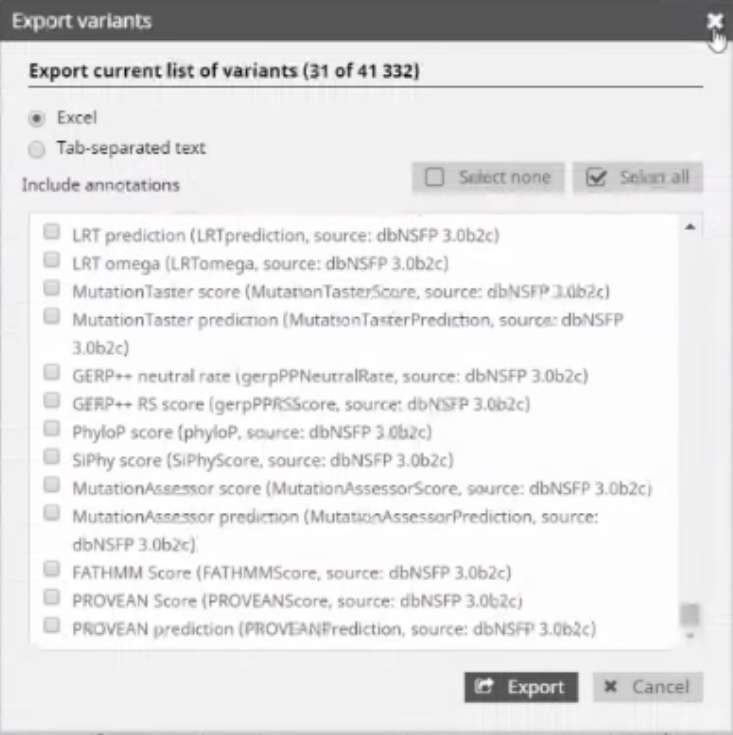{ loading=lazy }](./images/alissa/export.jpg)

=== "Labels"

    [{ loading=lazy }](./images/alissa/labelsconfig.jpg)

=== "Sources d'annotations"

    [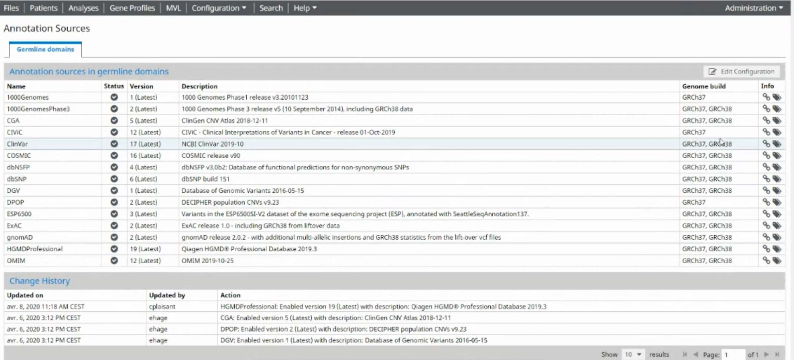{ loading=lazy }](./images/alissa/annotationsources.jpg)
```

=== "Report"

```
=== "Classification de variation"

    [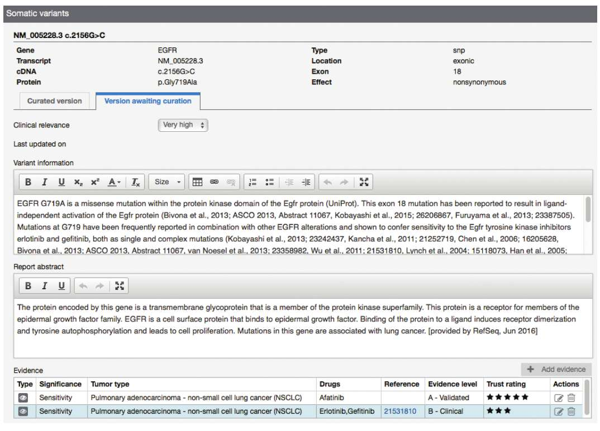{ loading=lazy }](./images/alissa/reportingform.jpg)

=== "Triage/Génération de rapport"

    [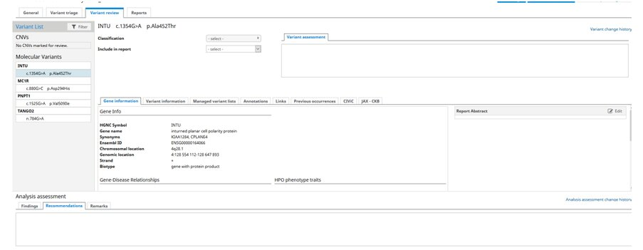{ loading=lazy }](./images/alissa/variantreview.jpg)
```

<object data='/ressources/similar_tools/Alissa.pdf' width="100%" height="800px"></object>
[Lien vers le document](/ressources/similar_tools/Alissa.pdf)
