# Cutevariant

Cutevariant est un outil développé en Python par Sacha Schutz du CHRU de Brest pour
l'affichage et le filtrage facile de VCF.

!!! note Cutevariant est disponible directement via pypi `pip install cutevariant`, pour
[Windows 64 bits](https://github.com/labsquare/cutevariant/releases/download/0.4.4/cutevariant_0.4.4.exe),
ou directement built depuis [son repo](https://github.com/labsquare/cutevariant).\
Nécessite sqlite ≥ 3.32

## Présentation générale

La première étape au lancement de Cutevariant est de créer un projet consistant en une
base SQLite.

Cutevariant a une approche agnostique permettant le chargement de VCF annotés sous la
forme `clef=valeur` et respectant le standard VEP/SnpEff (gérant le multi-transcrits).

La gestion des colonnes, des filtres, des classifications peut se faire par le GUI tout
comme en saisissant directement une requête VQL (équivalent de SQL).

C'est en l'occurrence un outil très bien réfléchi sur beaucoup d'aspects et digne de
servir d'inspiration en divers points.

[Use case](https://github.com/labsquare/cutevariant/wiki/Usage-examples)

## Interface

=== "Lancement"

```text
== "Nouveau projet"

    [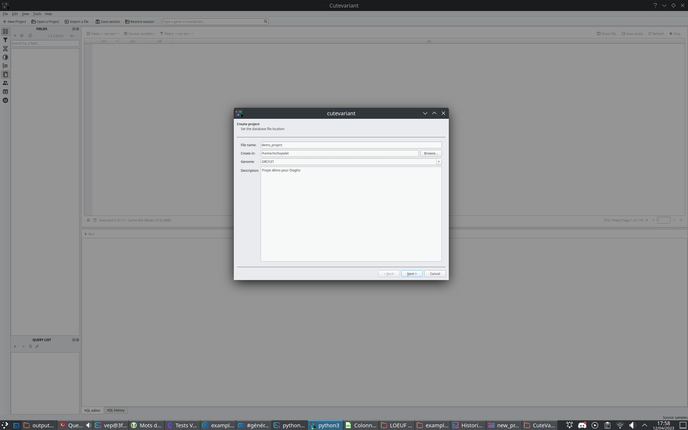{ loading=lazy }](./images/cutevariant/new_project.jpg)

=== "Nouveau VCF"

    Champs détectés dans le VCF et devant être chargés
    [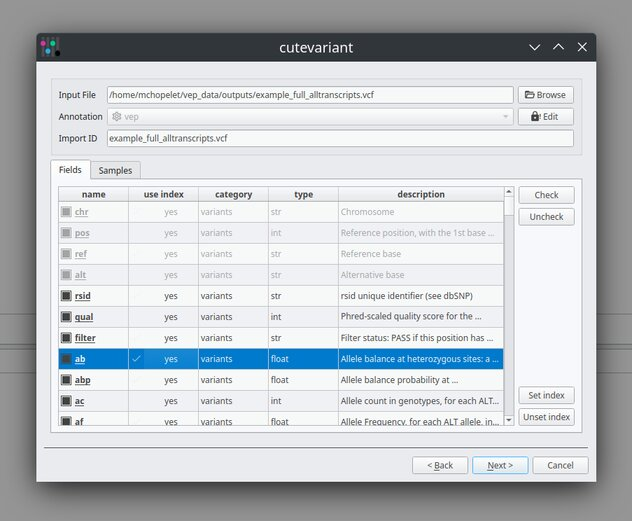{ loading=lazy }](./images/cutevariant/new_input.jpg)

=== "Samples"

    Samples détectés dans le VCF et gestion possible des PED
    [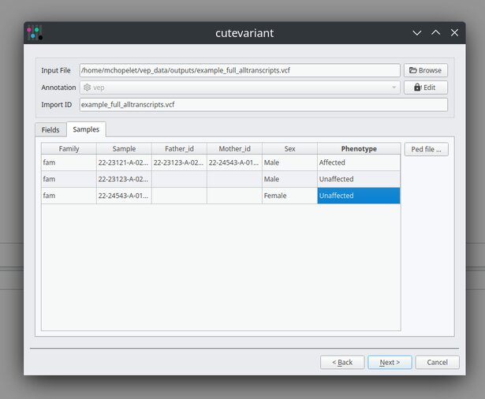{ loading=lazy }](./images/cutevariant/ped_data.jpg)

=== "Parsing"

    Samples détectés dans le VCF et gestion possible des PED
    [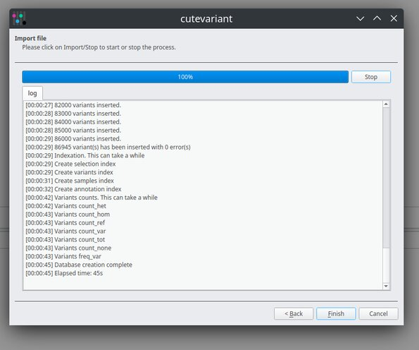{ loading=lazy }](./images/cutevariant/vcf_loaded.jpg)
```

=== "Tableau"

```text
== "Accueil"

    Dans cet exemple, les colonnes ont été choisies mais la modification n'a pas encore été appliquée
    [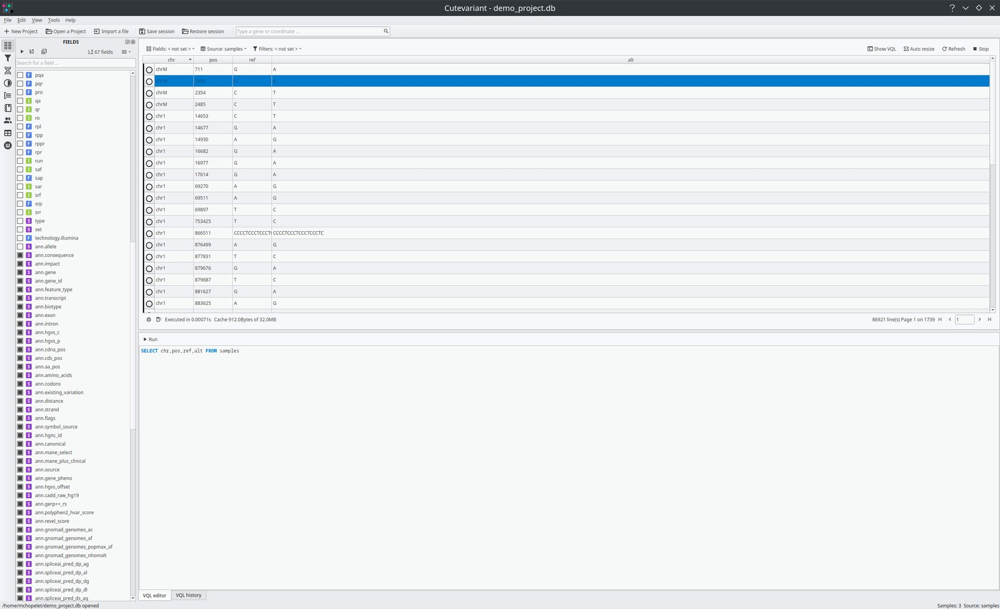{ loading=lazy }](./images/cutevariant/fields_settings.jpg)

=== "Colonnes configurées"

    Il est possible de sauvegarder en différents presets
    [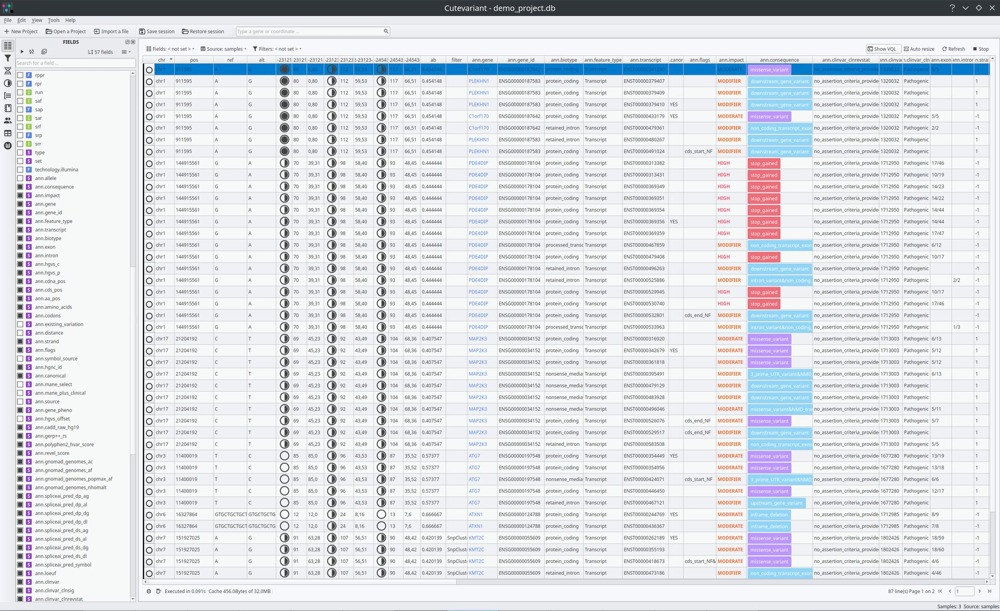{ loading=lazy }](./images/cutevariant/fields_configured.jpg)

=== "Réorganisation"

    Menu prévu pour réorganiser les colonnes retenues par drag and drop
    [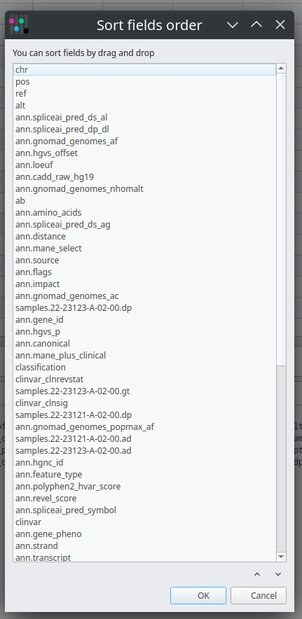{ loading=lazy }](./images/cutevariant/organize_columns.jpg)
```

=== "Filtres"

```text
== "Filtres avancés"

    Ces filtres peuvent être enregistrés pour une réapplication rapide.
    Les résultats sont stockés en cache pour être réaffichés instantanément.
    [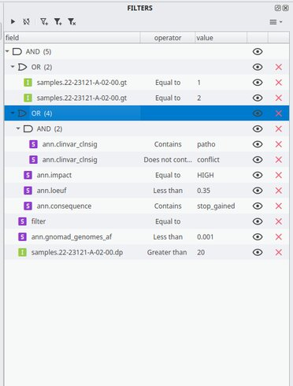{ loading=lazy }](./images/cutevariant/advanced_filter.jpg)

=== "Équivalent VQL"

    [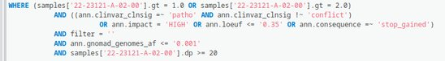{ loading=lazy }](./images/cutevariant/filter_in_vql.jpg)

=== "Ajout de nœuds"

    [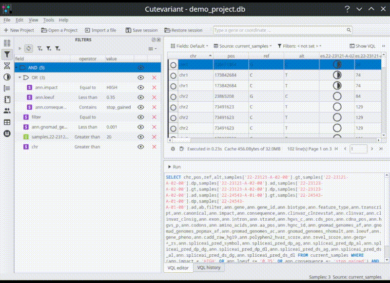{ loading=lazy }](./images/cutevariant/filter.gif)

=== "Autocomplétion du VQL"

    [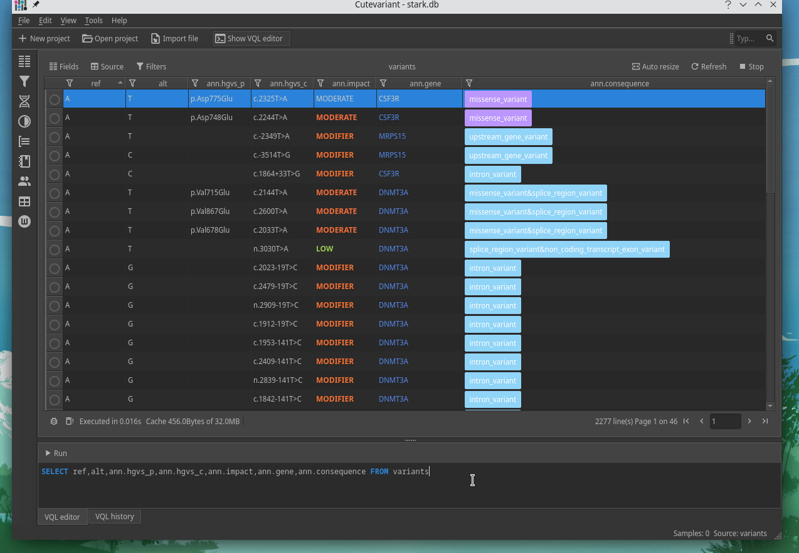{ loading=lazy }](./images/cutevariant/filtervql.gif)
```

=== "Features tableau"

```text
== "Gène"

    [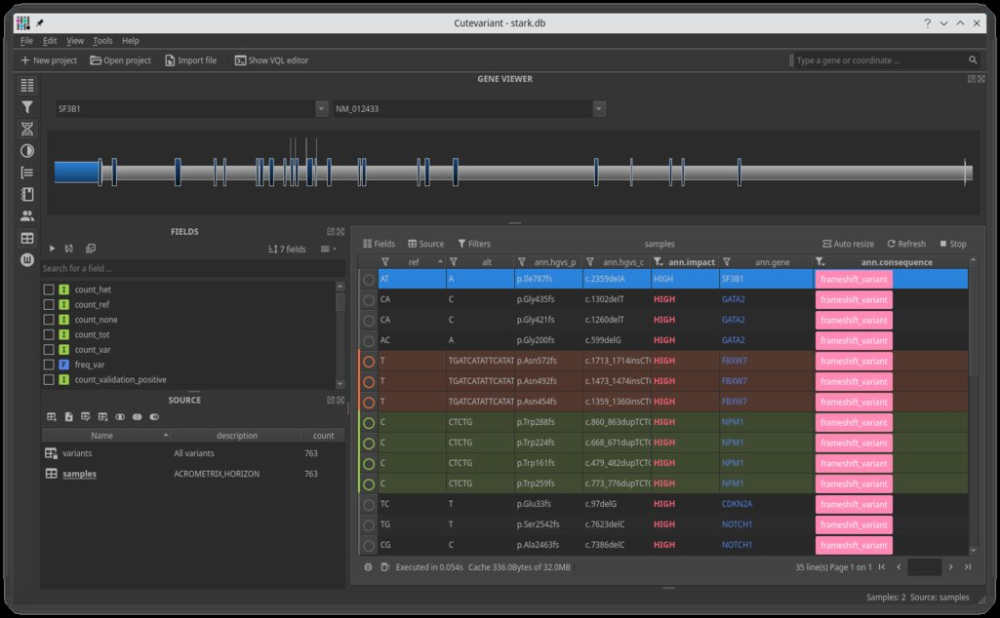{ loading=lazy }](./images/cutevariant/gene_veiwer.jpg)

=== "Wordset"

    Panels de termes, pouvant être utilisés dans d'autres contextes que les gènes.
    [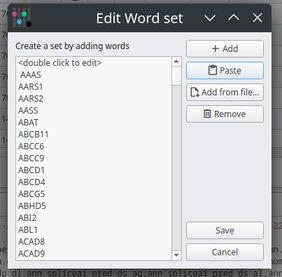{ loading=lazy }](./images/cutevariant/add_wordset.jpg)
    [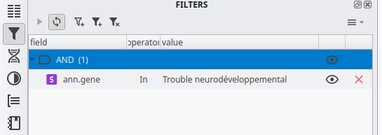{ loading=lazy }](./images/cutevariant/filter_with_panels.jpg)

=== "Group by"

    Permet d'avoir facilement le nombre de variations pour chaque valeur de chaque colonne. Peut servir de condition de filtrage en un double clic.
    [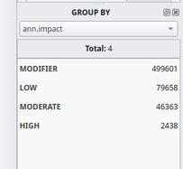{ loading=lazy }](./images/cutevariant/groupby.jpg)

=== "Sélection"

    Permet de facilement catégoriser un ensemble de variations répondant à certaines conditions. Même fonctionnement des tags pour le [prototype du Croisic](/functional_specification/front-end/pages/interpretation-table).
    [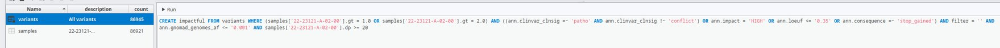{ loading=lazy }](./images/cutevariant/selection.jpg)
    [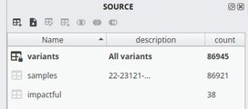{ loading=lazy }](./images/cutevariant/selection_created.jpg)

=== "Tooltip"

    Permet d'afficher en une infobulle toutes les informations de la variation (peu compatible pour cet exemple vu le nombre de champs retenus).
    [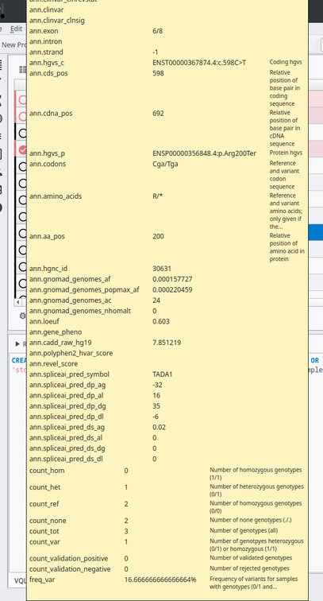{ loading=lazy }](./images/cutevariant/tooltip.jpg)
```

=== "Configurations"

```text
== "Liens externes"

    Permet d'ajouter des liens vers des sites externes en réutilisant le contenu de colonnes avec une syntaxe jinja2.
    [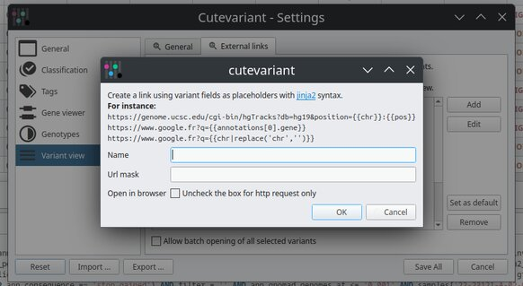{ loading=lazy }](./images/cutevariant/external_links.jpg)

=== "Tags"

    [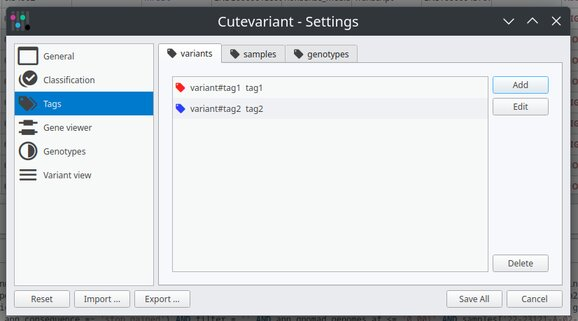{ loading=lazy }](./images/cutevariant/create_tag.jpg)

=== "Classification"

    [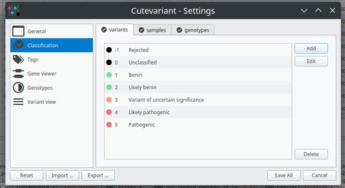{ loading=lazy }](./images/cutevariant/custom_classifications.jpg)
```

## Avis

| Points positifs                                                                     | Points négatifs                                                            |
| ----------------------------------------------------------------------------------- | -------------------------------------------------------------------------- |
| Très simple à mettre en place                                                       | … mais client ne le rendant pas compatible pour une utilisation partagée   |
| Approche totalement agnostique sur les VCF acceptés                                 |                                                                            |
| Parsing extrêmement rapide (5.8M var peu annotées chargées + indexées en ~13min)    | … mais DB "jetables" n'ayant pas vocation à stocker des milliers d'exomes  |
| Liberté totale sur les filtres, via GUI et requête DB                               | … mais le VQL rebute souvent les biologistes                               |
| Liberté totale sur les colonnes et sauvegarde de ces présets                        | … sauf la gestion de width qui est associée à une position et non un champ |
| Repose sur un système de plugins Qt permettant d'ajouter des controlleurs au besoin |                                                                            |

## Notes additionnelles

C'est l'outil initialement retenu par Auragen dans le cadre du PFMG2025 bien que non
adapté pour une utilisation dans une instance partagée.

## Liens

- [GitHub :octicons-link-external-16:](https://github.com/labsquare/cutevariant)
- [Site officiel :octicons-link-external-16:](https://cutevariant.labsquare.org/)
- [Documentation :octicons-link-external-16:](https://github.com/labsquare/cutevariant/wiki)
