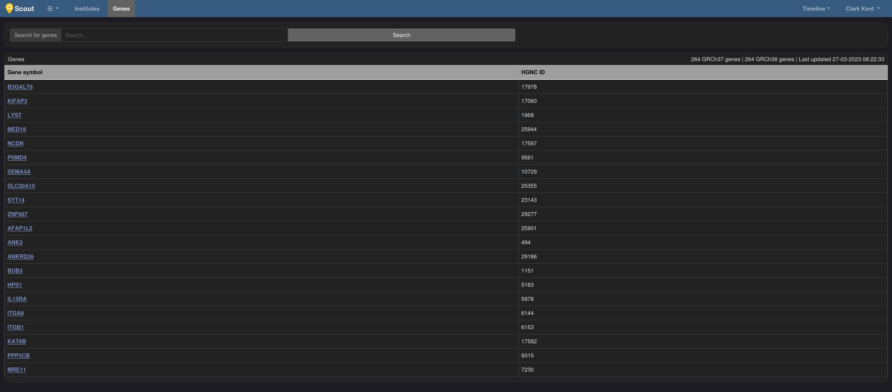
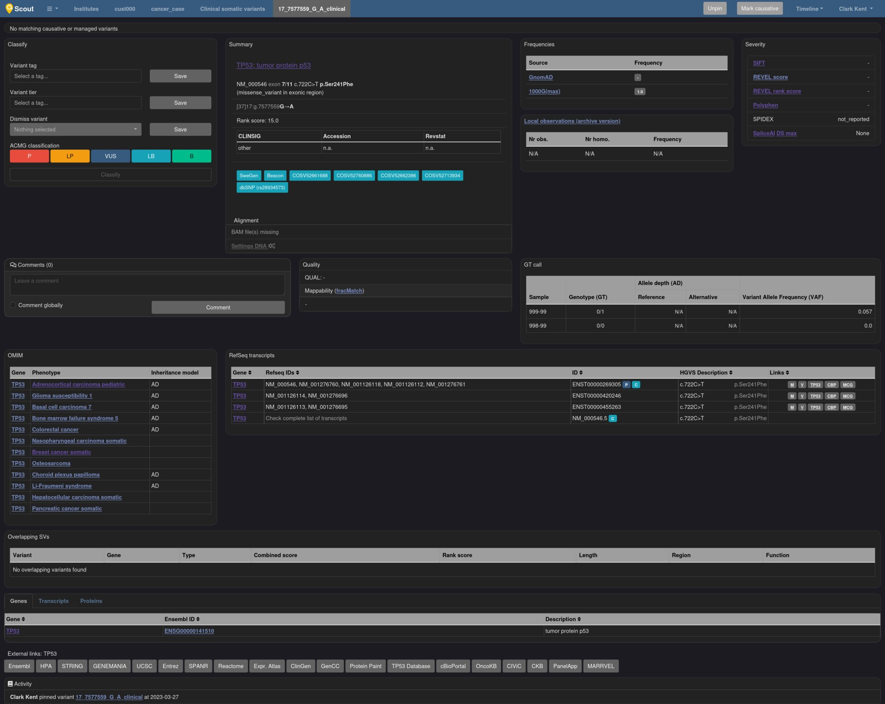

# Scout

Scout est un outil d'interprétation de variations génétiques sous licence BSD-3 en
développement encore actif depuis au moins 4 ans. L'outil est codé en Python et repose
sur Flask.  
Sa philosophie est davantage orientée vers un partage de découvertes entre laboratoires
qu'offrir un outil d'aide au diagnostic internalisé.

!!! note
    Il est possible d'installer facilement
    [une instance de démo](https://github.com/Clinical-Genomics/scout). Pour s'y connecter,
    l'email à entrer est `clark.kent@mail.com`

## Présentation générale

- Découpage en **Institutes** dans lesquels sont inclus des **cases**.
- Gère SNV, indels, SV et STR pour les maladies rares et la somatique.
- Orienté diag et interprétation de variations
- Partage sur ClinVar intégré

## Présentation détaillée

L'écran d'accueil nous liste les projets disponibles.

### Accueil

L'écran principal permet d'accéder à :

- la liste des **Institutes** (idée approchante de nos projets) pour accéder aux
  **cases**
- la liste des gènes dans la DB permettant d'accéder à une vue détaillée de ceux-ci
- la liste des panels de gènes dans la DB et création de nouveaux
- la liste des termes HPO
- la liste des termes OMIM
- un dashboard de suivi de l'instance et des **Institutes**

### Institutes

- Permet de réunir les **cases** en attente d'interprétation, en cours, résolus et
  ignorés.
- Permet de retrouver facilement les variations retenues causales au sein d'un
  Institute.
- Permet de définir des droits d'accès pour les utilisateurs.
- Permet de partager des filtres.
- Permet de créer des panels de phénotypes HPO.

### Cases

Ce sont l'équivalent des interprétations pour Diagho incluant l'écran d'accueil et les
tableaux pour les différents types de données.  
Ne contient pas de page dédiée aux QC mais génère automatiquement des **Reports** que ce
soit sous un format interne pour avoir tout le débrief d'une interprétation comme sous
la forme d'un compte-rendu d'analyse officiel.  
Les tableaux d'interprétation quant à eux sont présentés en dur avec un set de filtres
limités mais partageables.

## Interface

=== "Accueil"

    === "Home"

        Écran post-login
        [{ loading=lazy }](./images/scout/home.jpg)

    === "Gènes"

        Cliquer un symbole renvoie à la page `Vues détaillées/Gènes`
        [{ loading=lazy }](./images/scout/genes.jpg)

    === "Panels"

        Liste des panels créés
        [{ loading=lazy }](./images/scout/panels_list.jpg)
        Vue détaillée du panel
        [{ loading=lazy }](./images/scout/panel_details.jpg)

    === "HPO"

        Cliquer sur un id renvoir vers `https://hpo.jax.org/app/browse/term/HP:<id>`
        Cliquer sur le chaînon renvoi vers une vue détaillée interne listant les symboles de gènes associés, le type de transmission et les autres phénotypes associés.
        [{ loading=lazy }](./images/scout/hpo_list.jpg)

    === "OMIM"

        Cliquer sur un id renvoir vers `https://omim.org/entry/<id>`
        Cliquer sur le chaînon renvoi vers une vue détaillée interne listant les symboles de gènes associés, le type de transmission et les autres phénotypes associés.
        [{ loading=lazy }](./images/scout/diagnoses.jpg)

    === "Utilisateurs"

        Liste des utilisateurs, de leur adresse de contact, de leur institut de rattachement et de leur grade
        [{ loading=lazy }](./images/scout/users.jpg)

    === "Dashboard"

        Permet d'avoir des stats sur l'instance ou des instituts spécifiques
        [{ loading=lazy }](./images/scout/dashboard_institutes.jpg)

    === "Timeline"

        Suivi de toutes les activités d'un utilisateur
        [{ loading=lazy }](./images/scout/timeline.jpg)

=== "Institutes"

    === "Home"

        Écran d'accueil d'un institut. Semblable au principe de Projet pour Diagho
        [{ loading=lazy }](./images/scout/institute_home.jpg)

    === "Phenomodels"

        Possibilité de créer des "panels de phénotypes" au sein des instituts
        [{ loading=lazy }](./images/scout/phenomodel.jpg)
        [{ loading=lazy }](./images/scout/phenomodel_details.jpg)

    === "Settings"

        [{ loading=lazy }](./images/scout/add_options.jpg)

=== "Cas"

    === "Accueil"

        Écran à l'ouverture d'un cas. Équivalent de l'onglet Général prévu pour les interprétations sur Diagho.
        Offre un résumé du cas, des individus associés, du tableau clinique. Contient un audit trail de toute action liée à ce cas et permet d'ajouter des commentaires signés et datés partagés aux autres utilisateurs.
        Les boutons en haut (`Clinical SND and INDELs`…) renvoient vers les vues détaillées dans `Tableau`.
        [{ loading=lazy }](./images/scout/case_home.jpg)

    === "Diagnostiqué"

        Lorsque le diagnostic est fait :
        [{ loading=lazy }](./images/scout/case_home_diagnosed.jpg)

    === "Somatique"

        Pour un cas de cancer :
        [{ loading=lazy }](./images/scout/case_somatic.png)

    === "Features"

        Peut contenir des images liées :
        [{ loading=lazy }](./images/scout/case_home_images.jpg)
        Peut être lié à des groupes de phénotypes :
        [{ loading=lazy }](./images/scout/hpo_groups.jpg)

=== "Tableau"

    === "Lancement"

        Écran de base à l'ouverture d'un type de donnée. Les colonnes sont fixes et non configurables par l'utilisateur. La position exacte n'est même pas précisée sans rentrer dans `Vues détaillées/Variation`
        Un tri des variations par priorisation sur rank score est effectué (technique reposant toujours sur des choix arbitraires et pouvant tout autant faire gagner du temps que rendre le diagnostic impossible).
        [{ loading=lazy }](./images/scout/interptable.jpg)

    === "Menu filtres"

        Un set de filtres prédéfinis
        [{ loading=lazy }](./images/scout/interptable_filtersopen.jpg)

    === "Détails filtres"

        Filtre par GT
        [{ loading=lazy }](./images/scout/gt_filter.jpg)
        Filtre par région touchée
        [{ loading=lazy }](./images/scout/region_annotations_filter.jpg)
        Pathogénicité estimée sur ClinVar
        [{ loading=lazy }](./images/scout/clnsig_filter.jpg)
        Modèle génétique (estimé par Scout)
        [{ loading=lazy }](./images/scout/genetic_models_filter.jpg)

    === "Features tableau"

        Tooltip des gènes
        [{ loading=lazy }](./images/scout/gene_tooltip.jpg)
        Tootip des fréquences
        [{ loading=lazy }](./images/scout/multiple_freq_tooltips.jpg)
        Tooltip d'[hétérozygotie composite](/ressources/bioinformatics/filter_strategies/#heterozygote-composite) détectée
        [{ loading=lazy }](./images/scout/interptable_coupound_tooltip.jpg)
        Tooltip en cas de présence d'un SV couvrant cette position
        [{ loading=lazy }](./images/scout/overlappingsv_tooltip.jpg)
        Choix pour marquer une variation comme non pertinente
        [{ loading=lazy }](./images/scout/interptable_dismiss_options.jpg)
        Tooltip résultante
        [{ loading=lazy }](./images/scout/dismiss_tooltip.jpg)

=== "Autres analyses"

    === "STR"

        Gère les STR (variation du nombre de répétitions d'un court motif)
        [{ loading=lazy }](./images/scout/interptable_str.jpg)

    === "Somatique"

        Tableau pour un cas de cancer
        [{ loading=lazy }](./images/scout/somatic_sv.jpg)

=== "Vues détaillées"

    === "Gène"

        Vue détaillée des gènes
        [{ loading=lazy }](./images/scout/gene_details.jpg)

    === "Variation"

        Vue détaillée d'une variation dans le cadre d'une interprétation.
        Possibilité d'ajouter un commentaire signé, daté et partagé ou non aux autres utilisateurs.
        Contient des liens directs vers un grand nombre de BDD, liées à la variation ou au gène.
        Audit trail lié à la variation et permettant de garder en mémoire toute action utilisateur à son sujet.
        [{ loading=lazy }](./images/scout/variant_details.jpg)

    === "Variation somatique"

        Idem mais dans le cadre d'une analyse somatique
        [{ loading=lazy }](./images/scout/variant_details_somatic.jpg)

    === "SV"

        Idem pour une variation de structure (grosse portion d'ADN en moins ou en trop)
        [{ loading=lazy }](./images/scout/sv_details.jpg)

    === "STR"

        Idem pour un STR, mais encore assez mal géré
        [{ loading=lazy }](./images/scout/str_details.jpg)

=== "Reporting"

    === "Interne"

        Équivalent d'un rapport d'interprétation interne pour connaître les conclusions du biologiste
        [{ loading=lazy }](./images/scout/internal_report.png)

    === "Compte-rendu d'analyse"

        Compte-rendu d'analyse à renvoyer au médecin prescripteur et automatiquement rempli selon un template prédéfini
        [{ loading=lazy }](./images/scout/report_clinical.jpg)

## Avis

| Points positifs                                                                 | Points négatifs                                                                    |
| ------------------------------------------------------------------------------- | ---------------------------------------------------------------------------------- |
| Beaucoup de bonnes idées                                                        | … mais pas toujours pleinement implémentées                                        |
| Tri priorisation possible                                                       | … mais appliqué de force                                                           |
| Gestion des HPO et OMIM                                                         | … mais intégration semble-t-il encore à faire pour être utilisés en interprétation |
| Bonne traçabilité des actions utilisateurs                                      | UI perfectible                                                                     |
| Vue détaillée pour les variations intéressante                                  | Tableau rigide pour l'utilisateur sur la forme comme le contenu                    |
| Gère SV et fait le lien avec les données de SNV                                 |                                                                                    |
| Gère les STR                                                                    | … mais vue détaillée encore inadéquate                                             |
| L'écran d'accueil des cas peut être une bonne inspiration                       |                                                                                    |
| Permet de commenter en local et global les variations, gènes, cas               |                                                                                    |
| Permet de préciser la cause de rejet d'une variation                            | … mais de manière peu pratique                                                     |
| Possibilités d'enregistrer et partager des filtres                              | … mais les possibilités de filtrage restent limitées                               |
| Configuration apparemment facile en admin via un ensemble de lignes de commande |                                                                                    |
| Reporting inclu                                                                 | … mais sous format HTML/PDF uniquement et non customisable                         |

## Liens

- [GitHub :octicons-link-external-16:](https://github.com/Clinical-Genomics/scout)
- [Documentation :octicons-link-external-16:](https://clinical-genomics.github.io/scout/)
