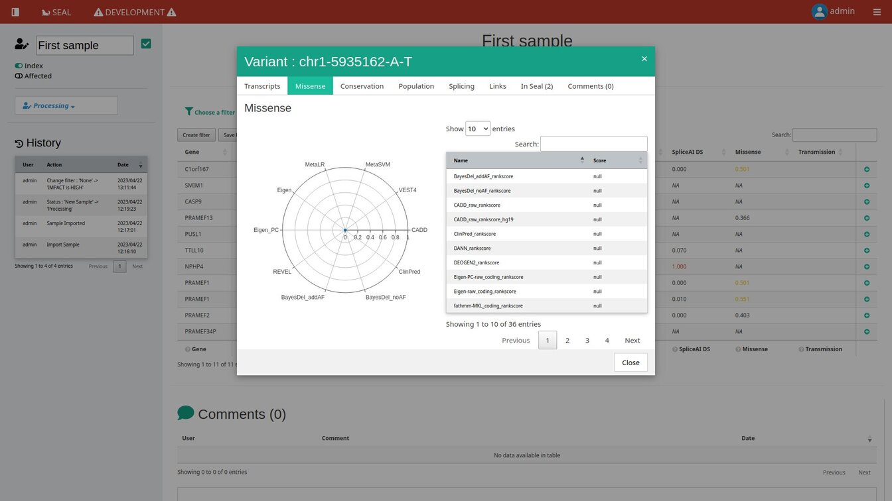
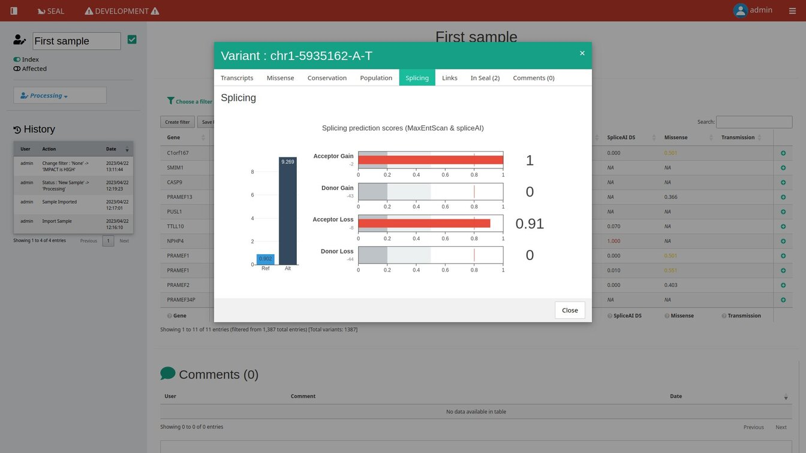

# SEAL

!!! note
Une démo est facilement testable [avec leur repo](https://github.com/mobidic/seal), mais pour l'installer cela nécessite Conda et d'avoir à disposition un certain nombre de DB.\
Celles de SpliceAI sont disponibles sur le serveur dans `/media/data/databases/SpliceAI` (nécessite snv et indels pour le génome choisi).

SEAL est un outil développé par Charles Van Goethem à Montpellier en Python, reposant sur Flask. Le développement a commencé récemment et en solo, ce qui en fait un outil aux fonctionnalités encore limitées mais offre une vision de MVP tout à fait respectable.

## Présentation générale

Outil reposant sur une annotation par VEP configurée en dur et purement orientée dans le filtrage de variations et une classification ACMG non assistée.

Les filtres sont totalement libres et peuvent être enregistrés pour être réappliqués rapidement et partagés globalement ou non.

Le tableau n'est pas modifiable par l'utilisateur et l'intégralité des variations du VCF uploadé sont chargés, provoquant des temps d'attente non négligeables. Même en cas d'application préalable d'un filtrage, le tableau devra d'abord être chargé entièrement avant d'afficher l'éventuelle poignée de variations retenues.

SEAL ne gère pas encore le multisample par analyse et s'attend à ce que les VCF uploadés ne concernent qu'un individu. La notification d'occurrences d'une variation dans d'autres analyses est faite via la DB. Son utilisation pour autre chose que des singletons semblent donc limitée.

## Interface

=== "Home"

```
=== "Login"

    [{ loading=lazy }](./images/seal/seal_login.jpg)

=== "Accueil"

    [{ loading=lazy }](./images/seal/seal_home.jpg)

=== "Nouveau sample"

    [{ loading=lazy }](./images/seal/seal_newsample.jpg)

=== "Progression"

    [{ loading=lazy }](./images/seal/seal_upload.jpg)

=== "Avancée des dossiers"

    [{ loading=lazy }](./images/seal/seal_home2.jpg)
```

=== "Tableau"

```
=== "Tableau"

    [{ loading=lazy }](./images/seal/seal_table.jpg)

=== "Classification"

    [{ loading=lazy }](./images/seal/seal_classification.jpg)

=== "Filtres"

    [{ loading=lazy }](./images/seal/seal_filters.jpg)

=== "Enregistrement filtre"

    [{ loading=lazy }](./images/seal/seal_savefilter.jpg)

=== "Export"

    [{ loading=lazy }](./images/seal/seal_export.jpg)
```

=== "Détails variations"

```
=== "Transcrits"

    [{ loading=lazy }](./images/seal/seal_vardet1.jpg)

=== "Prédiction"

    [{ loading=lazy }](./images/seal/seal_vardet2.jpg)

=== "Conservation"

    [{ loading=lazy }](./images/seal/seal_vardet3.jpg)

=== "Fréquences"

    [{ loading=lazy }](./images/seal/seal_vardet4.jpg)

=== "Epissage"

    [{ loading=lazy }](./images/seal/seal_vardet5.jpg)

=== "Liens externes"

    [{ loading=lazy }](./images/seal/seal_vardet6.jpg)

=== "Occurrences dans SEAL"

    [{ loading=lazy }](./images/seal/seal_vardet7.jpg)

=== "Commentaires"

    [{ loading=lazy }](./images/seal/seal_vardet8.jpg)
```

=== "Admin"

```
=== "Liste gènes"

    [{ loading=lazy }](./images/seal/seal_admin3.jpg)

=== "Liste transcrits"

    [{ loading=lazy }](./images/seal/seal_admin2.jpg)

=== "Filtres"

    [{ loading=lazy }](./images/seal/seal_admin4.jpg)

=== "Lien variant-sample"

    [{ loading=lazy }](./images/seal/seal_admin1.jpg)
```

=== "Features tour"

```
[{ loading=lazy }](https://raw.githubusercontent.com/mobidic/SEAL/main/docs/img/seal.gif)
```

## Avis

| Points positifs | Points négatifs |
| - | - |
| Va droit au but ce qui en fait un MVP tout à fait respectable | … mais avec les limitations intrinsèques que cela sous-tend |
| Annotation internalisée | … mais obligeant à travailler avec celles choisies par le développeur |
| Filtres totalement libres et sauvegardables | … dans la limite des annotations retenues |
| Calcul des filtres rapide et UI agréable | … mais nécessite le chargement initial de tout le tableau et entraîne de petits freezes à chaque nouvelle condition |
|  | Exploitation de VCF non pré-filtrés compliquée voire impossible via un réseau |
|  | Analyse singleton et encore |

## Liens

- [GitHub :octicons-link-external-16:](https://github.com/mobidic/SEAL)
