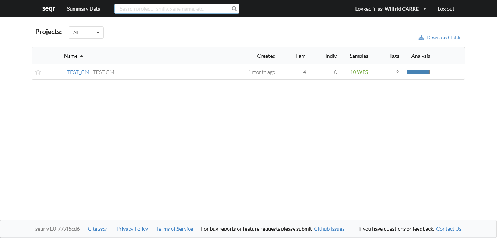
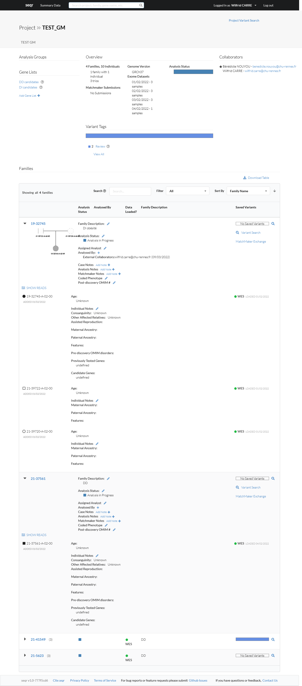
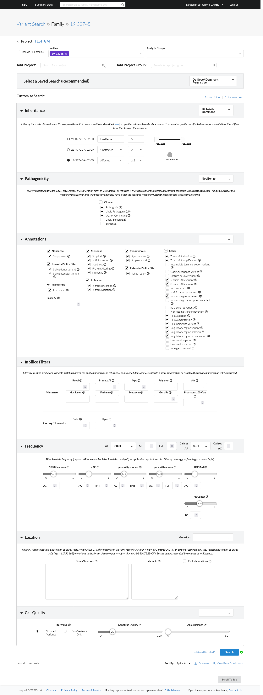
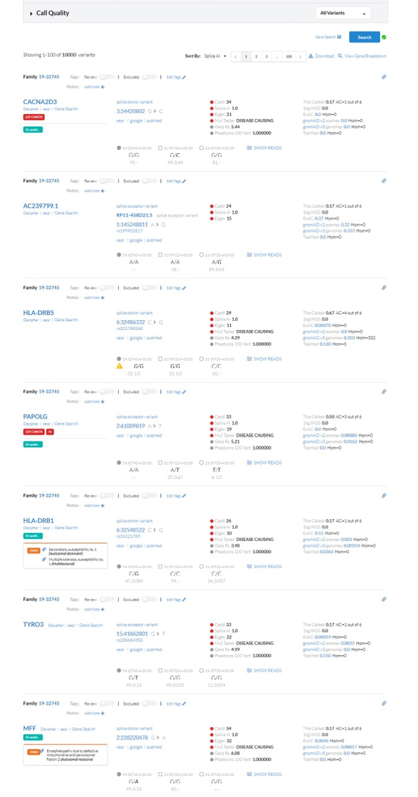
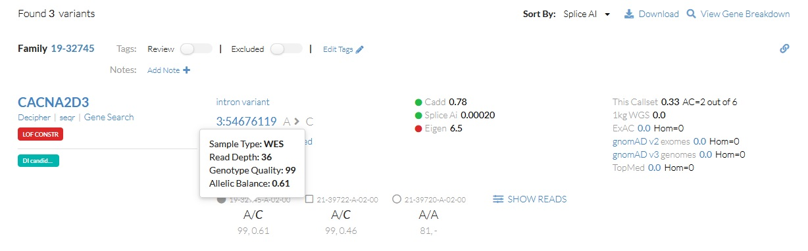
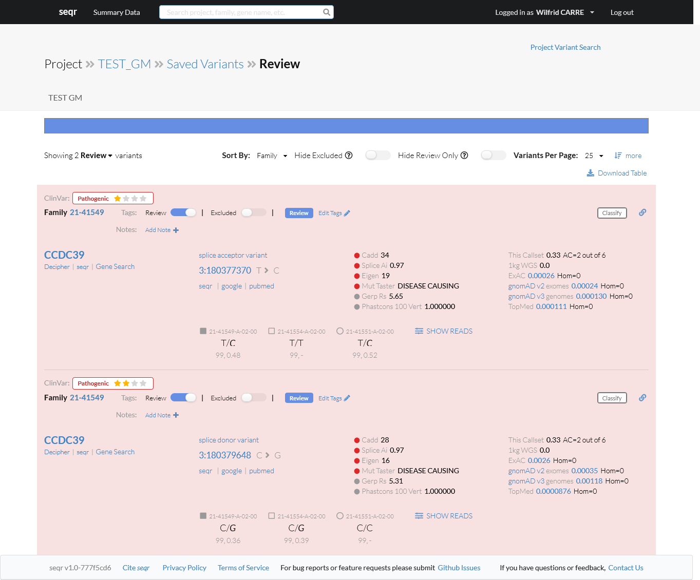
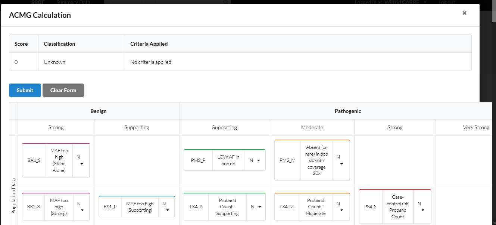

# seqr

Un outil open source d'analyse de variations en Python, focalisé sur la collaboration,
et développé par le Broad Institute sous licence AGPL3.0.

!!! info 
    Il est théoriquement possible d'installer seqr en local
    [ici](https://github.com/broadinstitute/seqr) mais bon courage si vous suivez cette
    voie.

## Présentation générale

- Découpage en **projets** dans lesquels sont inclus des **familles**.
- Il est possible de facilement faire des analyses conjointes de plusieurs familles.
- Orienté recherche et non diagnostic.
- Les features sont encore assez limitées et l'IU est discutable sur plusieurs aspects.
- Possibilité de facilement partager les variations trouvées sur MatchmakerExchange.

## Présentation détaillée

L'écran d'accueil nous liste les projets disponibles.

### Projet

L'overview du projet indique des informations générales comme le nombre d'individus
inclus, le génome de référence, et les utilisateurs participants au projet ainsi que le
nombre de variations retenues.

Les familles inclues dans le projet sont listées dans des containers collapsibles. 
Cela permet d'avoir facilement un détail des différentes familles avant de lancer une
recherche de variations, mais semble peu adaptée à des projets comptant de nombreuses
familles.

Pour débuter une interprétation, il faut cliquer sur "Variant search" dans une famille.

=== "Pros/Cons"

    | Points positifs | Points négatifs |
    | - | - |
    | Visualisation et ajout d'infos patients aisé | ...mais très gourmand en hauteur |
    | Tableau de familles exportable | |

=== "seqr home"

    { loading=lazy }

=== "Overview projet"

    { loading=lazy }

### Recherche de variations

Il est possible de facilement inclure d'autres familles voire des cohortes entières dans
une analyse de variations.

Le système de filtrage est simple voire simpliste dans ses possibilités. Il existe des
présets, mais aux résultats pour le moins discutables : même les "laxistes" ne renvoient
généralement aucune variation.  Lorsqu'ils sont faits à la main, le tableau peut
refuser de renvoyer les résultats car estimés trop nombreux (alors que 10000 variations
sont chargées à l'ouverture de la recherche).

Pour l'affichage des variations, il a été préféré une visualisation très aérée au prix
de peu de variations visibles à l'écran. Aucune customisation n'est possible, les mêmes
annotations sont calculées et affichées pour tout (si non nulles). Les fréquences de
gnomAD v2 **et** v3 sont utilisées. Leur ordre de tri ne se fait que par ordre
décroissant d'une des annotations proposées.

Il est possible de facilement voir la variation dans IGV.

Il existe des liens vers Decipher, seqr et Gene Search pour les gènes et seqr, pubmed et
google pour les variations.  Le code couleur des scores de prédiction est
visible. 

Si la variation est connue dans ClinVar, le fond de la variation est coloré en rouge ou
en vert. La créance en la pathogénicité estimée est visible.

Deux options "Review" et "Excluded" sont cochables (Excluded étant sans effet ici), il
est possible d'ajouter des tags d'une liste pré-établie et de joindre une note
personnelle.

=== "Pros/Cons"

    | Points positifs | Points négatifs |
    | - | - |
    | Ajout d'autres familles facile | Filtres laissent à désirer |
    | Tableau de variations très aéré | ...mais gourmand en hauteur |
    | Liens directs vers quelques DB | Tri possible que par ordre décroissant d'une annotation |
    | Classification ClinVar bien visible et avec la créance | Met surtout en avant les scores de prédiction |
    | Possibilité d'ajouter des tags | ...mais d'une liste pré-remplie |

=== "Filtres"

    { loading=lazy }

=== "Variations"

    { loading=lazy }

=== "Infobulle qualité"

    { loading=lazy }

### La revue de variations

Les variations retenues ne sont pas liées aux familles, mais au projet. Pour y accéder
il faut retourner à l'overview du projet et cliquer sur "Review".

Toutes les variations cochées "Review" y sont listées dans le même format que lors d'une
recherche de variations. Seulement dans cet écran il est possible de masquer les
variations cochées "Excluded".

Un bouton "Classify" permet d'ouvrir un menu peu ergonomique pour y appliquer les règles
ACMG, aucune n'étant pré-calculée.

=== "Pros/Cons"

    | Points positifs | Points négatifs |
    | - | - |
    |  | Pas prévue pour le diagnostic |
    |  | Même infos que pendant la fouille |
    | Formulaire de règles ACMG | ...mais à l'ergonomie médiocre pour ne pas dire bugguée |

=== "Review"

    { loading=lazy }

=== "ACMG"

    { loading=lazy }
