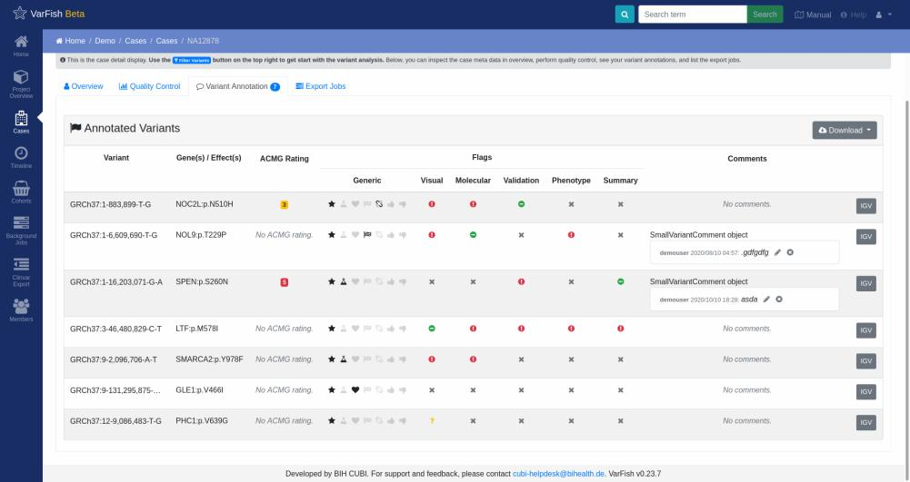
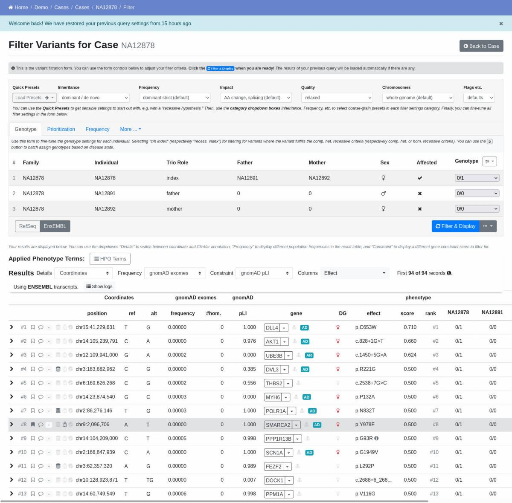
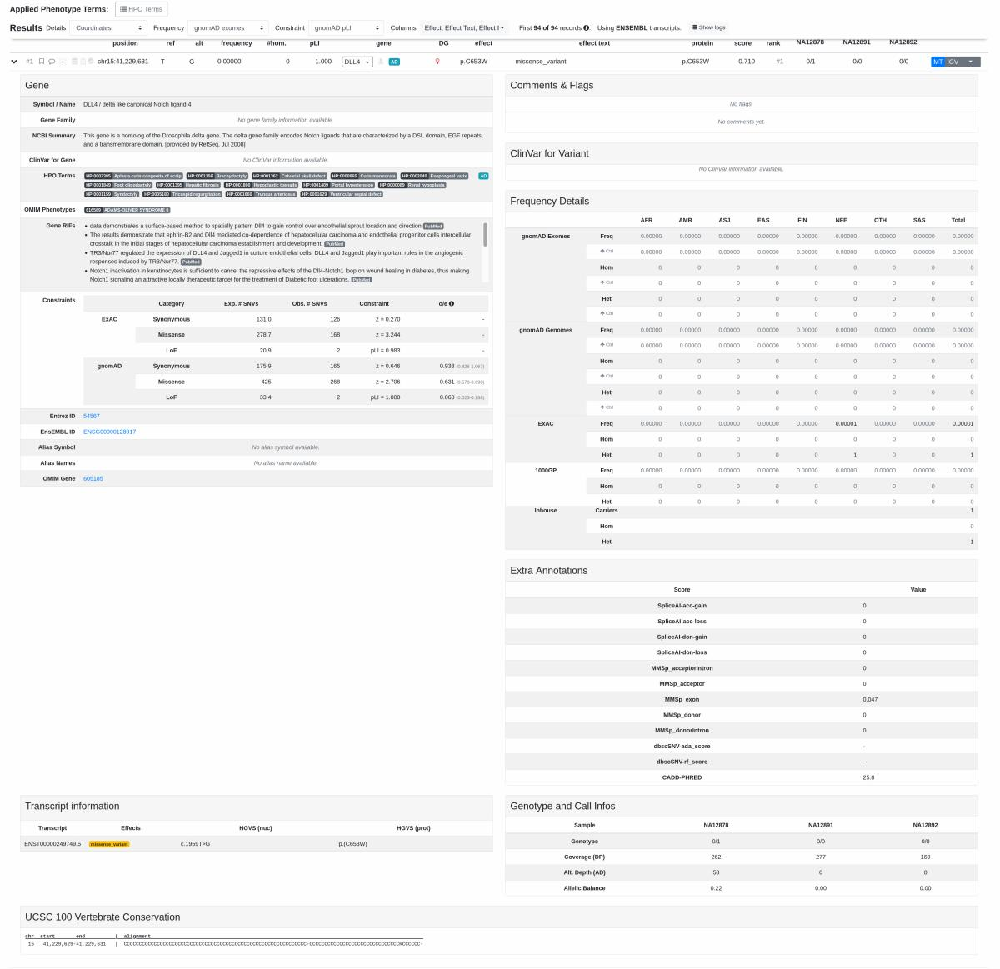
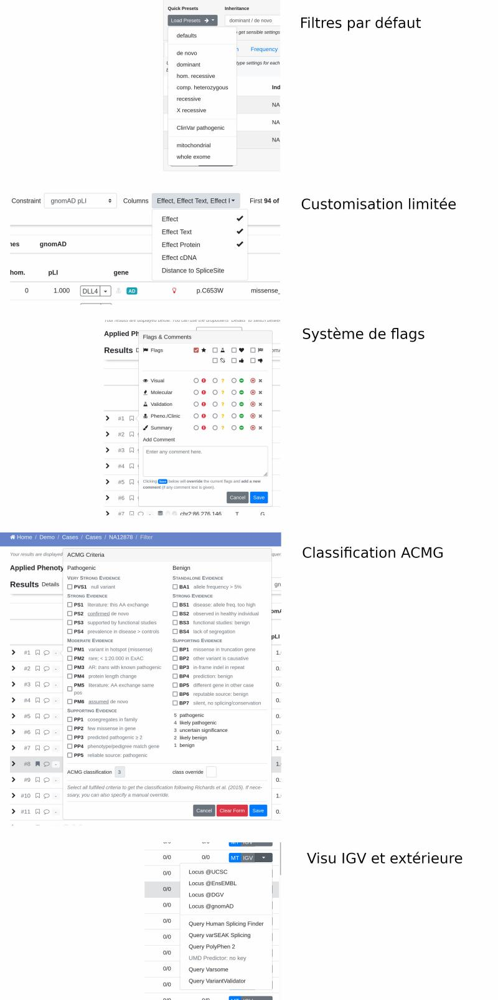

# VarFish

Un outil open source d'analyses de variations en Python et VueJS développé par le Health
Institute of Berlin sous licence MIT.

!!! info 
    Une version test est accessible librement
    [ici](https://varfish-demo.bihealth.org/) avec l'identifiant `demouser` et le mot de
    passe `varfishdemo`.   Il est également possible de tester la plateforme avec des
    données personnelles [ici](https://varfish-kiosk.bihealth.org/). Les données ne sont pas
    sécurisées et seront supprimées après deux semaines.

## Présentation générales

- Découpage en **projets**, eux-mêmes divisés en **catégories**.
- Les **cas** sont ajoutés dans les catégories.
- Il est possible d'analyser les cas d'une catégorie indépendamment ou ensemble (**Joint
  Filtration**).
- Il est possible de constituer des **cohortes** de cas.
- Une **timeline** garde le suivi des calculs et modifications effectuées au sein d'une
  catégorie.
- Système de QC maison.
- Système de classification des variations par règles ACMG, flags variés et commentaire.
- Filtres avec quelques presets.

## Présentation détaillées

### Home

L'accueil ne contient que la liste des **projets**.

Un projet contient un ReadMe et est divisé en **catégories**. Toutes les pages suivantes
sont dépendantes de la catégorie sélectionnée dans le projet.

### Catégorie

Équivalent d'un sous-projet inclus au sein d'un projet plus large.

L'overview contient un ReadMe, la liste des **cas**, une timeline des derniers
évènements au sein de la catégorie, une liste de **cohortes**, une liste des derniers
**background jobs** ayant nécessité un calcul, une liste des exports ClinVar.

Chacun de ces éléments a une page dédiée auxquelles s'ajoute une page Members pour
connaître la liste des utilisateurs associés à une catégorie ainsi que leur rôle.

=== "Pros/Cons"

    | Points positifs | Points négatifs  |
    | - | - |
    | Analyse conjointe de tous les cas en un clic |   |
    | Timeline incluse dans le projet | Redondance avec Background Jobs |
    | Cohortes listées dans le projet | |
    | Recherche facile des cas dans le projet |  |

=== "Accueil projet"

    { loading=lazy }

### Cas

_Case_ est le nom donné aux analyses d'un ou plusieurs samples.

L'**overview** (onglet "Général") détaille les individus inclus dans le cas et leur
pedigree, le statut de l'interprétation, les phénotypes associés, un espace
commentaires, les variations flag lors de l'interprétation, les versions des
annotations, et quelques QC.

L'onglet **Quality Control** contient des QC maison avec graphiques, tous exportables en
.tsv.

L'onglet **Variant Annotation** est l'équivalent d'un panier. La liste est très visuelle
mais la seule intéraction possible est une visualisation sur IGV et une modification de
commentaire.

L'onglet **Export Jobs** n'est qu'une liste des exports de données du cas.

!!! note
    Pour débuter l'interprétation en tant que telle, il faut passer par le bouton
    **Filter Variants** à l'écart en haut à droite.

=== "Pros/Cons"

    | Points positifs | Points négatifs |
    | - | - |
    | Overview intéressante |  Étrange de placer l'étape d'interprétation à cet endroit  |
    | QC visuels |  |
    | Liste de variations retenues très visuelles | ...mais trop statique |

=== "Général"

    { loading=lazy }

=== "QC"

    { loading=lazy }

=== "Variations retenues"

    { loading=lazy }

### Interprétation

L'outil mémorise les queries passées pour les recharger plus rapidement la fois
suivante.

Système de filtres avec quelques presets. Il est possible d'inclure des termes HPO pour
permettre une priorisation par Exomiser mais les résultats se sont avérés peu
probants.  Il est également possible d'effectuer une priorisation par MutationTaster
ou CADD.

Il est possible de blacklister un panel de gènes. Pour la whitelist, il est possible
d'importer des panels directement depuis PanelApp, et de filtrer par régions
chromosomiques.  Les filtres sont exportables et importables en format JSON.

Une très légère customisation d'affichage est possible (quelle DB de fréquence, quel
score gnomAD utiliser, afficher/masquer quelques colonnes).

Une annotation personnelle est possible facilement avec flags variés et système de
validation des observations (vu sur IGV, validation wet-lab...) et permet l'ajout d'un
commentaire personnel.

Possibilité de facilement accéder aux pages du gène dans différentes DB.  Système
d'accordéon réunissant des informations sur le gène, des commentaires et flags associés,
les fréquences dans différentes DB, les scores prédictifs...

=== "Pros/Cons"

    | Points positifs | Points négatifs |
    | - | - |
    | Queries stored | ...mais recalcul à chaque changement de page. |
    | Blacklist possible de panels | Menu de filtres désordonnés |
    | Panels importables directement via PanelApp |  |
    | Filtre possible par flags | ...mais IU discutable |
    | Import/export de filtres par JSON | |
    | Réglage du nombre de lignes à afficher | |
    | Mode training pour masquer les flags | |
    | Logs des calculs |  |
    | Lignes compactes |  |
    | Customisation possible | ...mais très limitée |
    | Accordéon avec infos gènes | ...mais très mal présenté |
    | Liens rapides du gène vers DB externes |  |
    | Bouton IGV et queries DB externes |  |

=== "Filtres et tableau"

    { loading=lazy }

=== "Accordéon"

    { loading=lazy }

=== "Features"

    { loading=lazy }

### Autres

VarFish permet de créer facilement des cohortes au sein d'une catégorie, un submit
facilité vers Clinvar et un audit précis des actions entreprises au sein d'une
catégorie.

| Points positifs                               | Points négatifs                               |
| --------------------------------------------- | --------------------------------------------- |
| Création de cohortes simples                  | ...mais recalcul à chaque changement de page. |
| Suivi timeline et background jobs             | ...mais beaucoup de doublons entre les deux   |
| Submit Clinvar                                |                                               |
| Utilisateurs liés à la carégorie et leur rôle |                                               |
