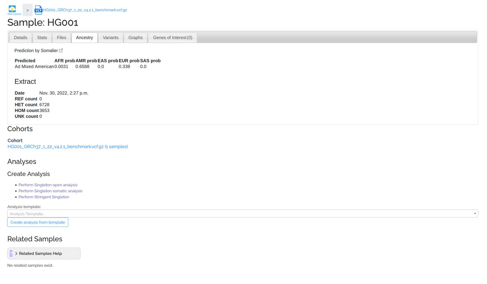
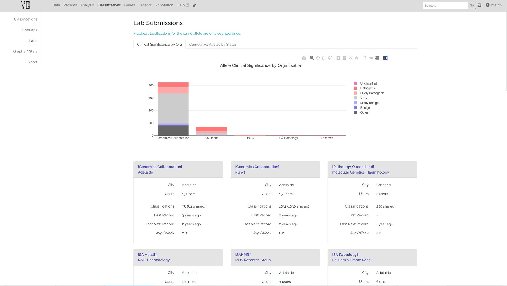
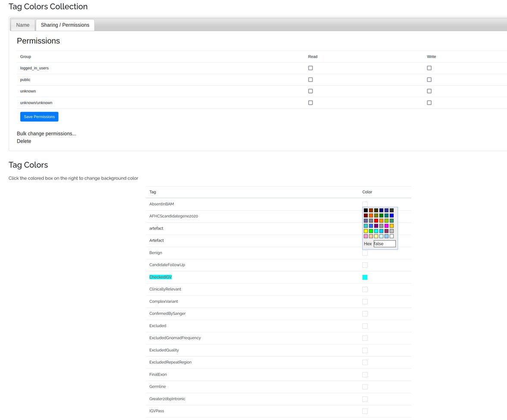

# VariantGrid

VariantGrid est un outil d'interprétation de variations génomiques développé en Python via Django par les australiens de l'ACRF Cancer Genomics Facility sous Business Source License 1.1, davantage orienté vers le partage de résultats d'interprétation que pour le diagnostic pur.

!!! note
    Pour tester l'outil, RDV à [ce lien](https://variantgrid.com/accounts/login/) et utilisez :    
    Username : `match`  
    Password : `2J|?u=9k}5_hQ7LTZ/Fk`  

## Présentation générale

### Annotations

Leur [poster](https://variantgrid.com/static/pdf/VariantGrid_Australian_Bioinformatics_Conference_poster.pdf) offre une présentation générale du projet et un aperçu du fonctionnement de l'outil.

[{ loading=lazy align=right width="400" }](./images/variantgrid/benchmark.jpg)

Les VCF chargés sont intégralement annotés par VEP via une configuration globale et choisie par les admins. Il est possible via une ligne de commande d'ajouter de nouveaux champs à récupérer des annotations de VEP ce qui entraînera un ajout de colonnes dans la DB.

Les annotations sont versionnées, évitant une ré-annotation ultérieure de variation déjà connues.

De leur aveu même, ce fonctionnement n'est cependant pas compatible avec l'analyse de génomes ou au delà d'une masse critique d'exomes.

### Filtrage

Un point intéressant de cet outil est son application de filtres via un graphe rappelant sommairement le fonctionnement d'Alissa. L'UX est tout à fait perfectible, notamment dans la création du filtre, mais offre d'ores et déjà une représentation visuelle, facile à traverser lors d'une analyse, réutilisable avec un suivi de version et partageable entre utilisateurs selon les autorisations accordées par son créateur.

En prenant l'example du graphe ci-dessous (`Analyses/Node count`), le recomptage en 4 sous-sets des variations de chaque nœud prend moins de 5s pour un sample de 34411 variations et environ 2min40 pour 3,9M variations. Ce comptage est fait de manière progressive, permettant de commencer à fouiller les premiers nœuds avant la fin du comptage du graphe entier.  
Ce comptage est conservé lors d'une réouverture ultérieure de l'analyse.

### Partage

Cet outil reste orienté avant tout vers le partage de résultats plutôt que le diagnostic et a donc un fort investissement dans les échanges entre laboratoires et un upload simplifié de résultats sur des outils comme ClinVar et GeneMatcher.

## Interface

=== "Data"

    Les écrans de gestion des fichiers d'entée

    === "Samples"

        === "Liste"

            [{ loading=lazy }](./images/variantgrid/data/samples.jpg)

        === "Details"

            [{ loading=lazy }](./images/variantgrid/data/sample_related.jpg)

        === "Stats"

            [{ loading=lazy }](./images/variantgrid/data/sample_stats.jpg)

        === "Files"

            [{ loading=lazy }](./images/variantgrid/data/sample_files.jpg)

        === "Ancestry"

            [{ loading=lazy }](./images/variantgrid/data/sample_ancestry.jpg)

        === "Variants"

            [{ loading=lazy }](./images/variantgrid/data/sample_variants.jpg)

    === "VCF"

        === "Details"

            [{ loading=lazy }](./images/variantgrid/data/vcf_details.jpg)

        === "Stats"

            [{ loading=lazy }](./images/variantgrid/data/vcf_stats.jpg)

        === "VCF Info"

            [{ loading=lazy }](./images/variantgrid/data/vcf_info.jpg)

        === "Relate"

            [{ loading=lazy }](./images/variantgrid/data/vcf_relate.jpg)

        === "Ancestry"

            [{ loading=lazy }](./images/variantgrid/data/vcf_ancestry.jpg)

    === "BED"

        [{ loading=lazy }](./images/variantgrid/data/bed_details.jpg)

    === "PED"

        [{ loading=lazy }](./images/variantgrid/data/ped_details.jpg)

=== "Patients"

    === "Liste"

        [{ loading=lazy }](./images/variantgrid/patients/patients_list.jpg)

    === "Détails"

        Auto-détection dans la description clinique de termes HPO, OMIM et de noms de gènes

        [{ loading=lazy }](./images/variantgrid/patients/patients_details.jpg)

    === "Trio"

        [{ loading=lazy }](./images/variantgrid/patients/trio_details.jpg)

    === "Cohorte"

        [{ loading=lazy }](./images/variantgrid/patients/cohorts_details.jpg)

=== "Analyses"

    === "Liste"

        [{ loading=lazy }](./images/variantgrid/analysis/analyses_list.jpg)

    === "Tableau"

        [{ loading=lazy }](./images/variantgrid/analysis/table.jpg)

    === "Node count"

        [{ loading=lazy }](./images/variantgrid/analysis/node_counts.jpg)  
        Un recompte des filtres pour 34k variations prend moins de 5s.  
        Sur le même arbre, 3,9M de variations sont totalement recomptées en 2min40.  
        <iframe src="https://streamable.com/e/b1s2sp?autoplay=1&nocontrols=1" width="560" height="593" frameborder="0" allowfullscreen allow="autoplay"></iframe>

=== "Filtrage"

    === "Template"

        Ce qui s'apparenterait à l'idée des stratégies de filtrage pour Diagho.  
        Le template permet une réutilisation simplifiée, mais rien n'empêche de le faire directement en cours d'analyse.

        === "Liste"

            [{ loading=lazy }](./images/variantgrid/analysis/templates_list.jpg)

        === "Création"

            [{ loading=lazy }](./images/variantgrid/analysis/template_details.jpg)

        === "Annot. versions"

            [{ loading=lazy }](./images/variantgrid/analysis/analyses_annotation_version.jpg)

        === "Liste des nœuds"

            [{ loading=lazy }](./images/variantgrid/analysis/template_node_types.jpg)

        === "Venn node"

            [{ loading=lazy }](./images/variantgrid/analysis/venn_node_settings.jpg)

        === "Règles de partage"

            [{ loading=lazy }](./images/variantgrid/analysis/template_permissions.jpg)

    === "Filtres"

        Exemples de settings de quelques nœuds

        === "Sample"

            [{ loading=lazy }](./images/variantgrid/analysis/filter_sample.jpg)

        === "Tags"

            [{ loading=lazy }](./images/variantgrid/analysis/filter_tags.jpg)

        === "Impact"

            [{ loading=lazy }](./images/variantgrid/analysis/filter_effect.jpg)

        === "Population"

            [{ loading=lazy }](./images/variantgrid/analysis/filter_pop.jpg)

        === "Panel"

            [{ loading=lazy }](./images/variantgrid/analysis/filter_panel.jpg)

        === "Intervals"

            [{ loading=lazy }](./images/variantgrid/analysis/filter_interval.jpg)

        === "Phénotype"

            [{ loading=lazy }](./images/variantgrid/analysis/filter_pheno1.jpg)
            [{ loading=lazy }](./images/variantgrid/analysis/filter_pheno2.jpg)

=== "Classifications"

    VariantGrid a une philosophie très orientée sur le partage de résultats

    === "Class. de var."

        [{ loading=lazy }](./images/variantgrid/classifications/classification_new.jpg)

    === "Ajout critère ACMG"

        [{ loading=lazy }](./images/variantgrid/classifications/classification_ba.jpg)

    === "Stats des classifications"

        [{ loading=lazy }](./images/variantgrid/classifications/classification_stats.jpg)

    === "Stats de partages"

        [{ loading=lazy }](./images/variantgrid/classifications/classification_shared.jpg)

    === "Concordance des partages"

        [{ loading=lazy }](./images/variantgrid/classifications/classification_shared_concordance.jpg)

    === "Audit trail"

        [{ loading=lazy }](./images/variantgrid/classifications/classification_audit_trail.jpg)

=== "Gènes"

    === "Gene grid"

        [{ loading=lazy }](./images/variantgrid/genes/genegrid.jpg)

    === "Détails"

        [{ loading=lazy }](./images/variantgrid/genes/gene_detail.jpg)

    === "Transcrits"

        [{ loading=lazy }](./images/variantgrid/genes/canonicaltranscriptsset_details.jpg)

    === "Panels"

        Liste
        [{ loading=lazy }](./images/variantgrid/genes/genelist_list.jpg)
        Détails
        [{ loading=lazy }](./images/variantgrid/genes/geneslist_details.jpg)

    === "Wiki"

        Idée du commentaire sur un gène partagé avec tous les utilisateurs
        [{ loading=lazy }](./images/variantgrid/genes/genewiki_list.jpg)

=== "Variations"

    === "Détails"

        [{ loading=lazy }](./images/variantgrid/variants/variant_detail.jpg)

    === "Saisie manuelle"

        [{ loading=lazy }](./images/variantgrid/variants/variant_manual_entry.jpg)

    === "Wiki"

        Idée du commentaire sur une variation partagé avec tous les utilisateurs
        [{ loading=lazy }](./images/variantgrid/variants/variant_wiki.jpg)

    === "Variations tagguées"

        Tags partagés au sein de l'instance
        [{ loading=lazy }](./images/variantgrid/variants/variants_tags.jpg)

=== "Annotations"

    === "Sources"

        [{ loading=lazy }](./images/variantgrid/annotation/annotations_home.jpg)

    === "Descriptions"

        Découpage par cibles : sample, transcript, variant, gene
        [{ loading=lazy }](./images/variantgrid/annotation/annotations_descriptions.jpg)

    === "Versions"

        [{ loading=lazy }](./images/variantgrid/annotation/annotations_versions_list.jpg)

=== "Autres"

    === "Config de colonnes"

        === "Liste des config"

            [{ loading=lazy }](./images/variantgrid/settings/custom_columns_list.jpg)

        === "Configuration"

            [{ loading=lazy }](./images/variantgrid/settings/custom_columns_details.jpg)

        === "Règles de partage"

            [{ loading=lazy }](./images/variantgrid/settings/custom_columns_permissions.jpg)

    === "Config de tags"

        Ils ont un usage extra-analyse dans VariantGrid
        [{ loading=lazy }](./images/variantgrid/settings/tags_color_collection.jpg)

    === "Recherche"

        [{ loading=lazy }](./images/variantgrid/settings/search_screen.jpg)

    === "Config user"

        [{ loading=lazy }](./images/variantgrid/settings/user_settings.jpg)

## Avis

| Points positifs | Points négatifs |
| - | - |
| Repose sur Django, permettant de comparer des solutions | … mais ont une approche foncièrement différente |
| Le graphe de filtres | … bien que largement perfectible dans son utilisation en front |
| La reconnaissance de termes dans les dossiers patients | … bien que perfectible côté front |
| Une annotation versionnée censée faire gagner du temps au fil des ajouts | … mais menant ineluctablement à des problèmes de scalabilité |
| Un form de classification plutôt rodé | Un fonctionnement pas comparable dû à la législation européenne |
| Customisation user du tableau et partage de ces configs |  |

## Liens
- [GitHub :octicons-link-external-16:](https://github.com/SACGF/variantgrid)
- [Documentation :octicons-link-external-16:](https://github.com/SACGF/variantgrid/wiki)
- [Instance de test :octicons-link-external-16:](https://variantgrid.com/accounts/login/)
- [Poster :octicons-link-external-16:](https://variantgrid.com/static/pdf/VariantGrid_Australian_Bioinformatics_Conference_poster.pdf)