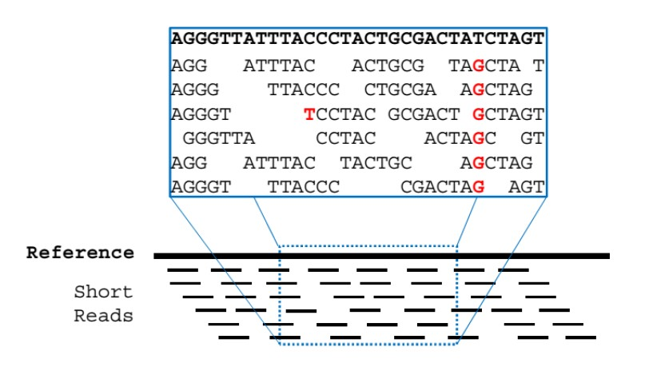

# Pipeline bioinformatique

!!! note
Chapitre le plus important pour débuter : [le fichier VCF](#variant_calling)

Les pipelines bioinformatiques consistent dans notre contexte au traitement de la donnée brute issue produite par le séquenceur en des fichiers utilisables pour l'interprétation entre autres.\
Ils varient d'un laboratoire à l'autre, voire d'une indication à l'autre, utilisent différents outils, différentes configurations, mais dans le cadre du séquençage *short reads* qui nous concerne ici, les grandes étapes restent similaires.

{ width=100% }

## Séquençage

Sans rentrer dans les détails techniques\[^1\], dans le cadre de séquençages dit *short reads*, les ADN des patients sont morcelés en une multitude de fragments de plus ou moins une centaine de bases puis transcrits dans un fichier **FASTQ**. Chacun de ces fragment est appelé un **read**.

Pour chaque read, le FASTQ contient 4 lignes de texte :

- un id
- le read même
- un symbole "+"
- qualité Phred en ASCII (chaque caractère équivaut à un nombre, lui-même estimant la créance dans la base séquencée calculée par le séquenceur)

<a href="/ressources/newcomers/images/fastq.png">
    <figure>
        
        <figcaption>Exemple de fichier FASTQ</figcaption>
    </figure>
</a>

## Alignement ou *mapping*

Cette étape repose sur un **génome de référence**. Il consiste en un génome fictif considéré exempt de toute variation délétère. Les versions actuelles sont GRCh37 (ou hg19) qui tend à être supplanté par GRCh38 (ou hg38).

L'alignement consiste alors au fait de positionner chaque read du FASTQ sur ce génome de référence. C'est en quelque sorte comme chercher à positionner les pièces d'un puzzle en se servant de l'illustration sur la boîte.

!!! tip "Profondeur ou depth (DP)"
Le nombre de reads couvrant une base s'appelle sa profondeur et est notée `[numéro]X`. Sur l'image ci-dessus, la première A à gauche aurait une DP de 5X, et la G qui la suit une DP de 6X.\
C'est un marqueur de qualité quant à l'alignement d'une position. On estime qu'une profondeur inférieure à 20X est peu fiable.

Le fichier produit est un **SAM**\[^2\] (fichier texte d'environ 30Go pour un exome), mais dans les faits, ils sont systématiquement compressés au moins en **BAM** (= SAM zippé binaire d'environ 8Go), voire en **CRAM**\[^3\] (~2× mieux compressé que les BAM mais moins bien supportés par les outils bioinfo et nécessitant de garder le génome de référence utilisé).

<a href="/ressources/newcomers/images/sam.jpg">
    <figure>
        
        <figcaption>Exemple de fichier SAM</figcaption>
    </figure>
</a>

## Appel de variants ou *variant calling* {#variant_calling}

Cette étape consiste à retenir les différences, nommées **variations** (ou variants), observées entre les reads et le génome de référence. Loin d'être une étape anodine, d'un algoritme à l'autre, les résultats peuvent être très variables.

<a href="/ressources/newcomers/images/callingdiff.jpg">
    <figure>
        
        <figcaption>Inconstance du nombre de variations retenues selon le caller utilisé</figcaption>
    </figure>
</a>

Les callers produisent un fichier **VCF**\[^4\] (Variant Call Format) qui servira de fichier d'entrée à Diagho.\
C'est un fichier texte dont chaque ligne, outre le header, correspond à une variation retenue.

<a href="/ressources/newcomers/images/vcf.jpg">
    <figure>
        
        <figcaption>Exemple de fichier VCF</figcaption>
    </figure>
</a>

Les champs indispensables sont le CHROM, la POS (position où se situe la variation), la REF (base sur le génome de référence) et l'ALT (la base discordante observée sur des reads).

- L'ID est un identifiant unique optionnel pour la variation
- La QUAL est une estimation de la créance à apporter à l'appel de cette variation
- FILTER renseigne si la variation ne remplit pas des filtres prédéfinis lors du calling
- INFO apporte des informations complémentaires sur la variation
- FORMAT précise l'ordre des champs des samples (ici génotype:qualité:profondeur…)
- Chaque colonne suivante est un échantillon, c'est à dire les donnée d'un patient sur une variation

!!! note
Plus de détails dans [la page dédiée](/ressources/bioinformatics/vcf)

## Annotation et filtrage

L'étape d'annotation consiste en l'enrichissement du fichier VCF en annotations supplémentaires, issues de bases de données variées, qui seront insérées dans la colonne INFO.\
Ces annotations peuvent être de natures très variées comme le gène où se situe la variation et son transcrit canonique, sa fréquence d'occurrence dans la population, si elle est rapportée comme étant délétère, sa conservation entre espèces, sa pathogénicité estimée par des algoritmes in silico…

Il existe trois annotateurs largement utilisés pour cette tâche : [VEP](https://www.ensembl.org/info/docs/tools/vep/index.html), [Annovar](https://annovar.openbioinformatics.org/en/latest/) et plus rarement [SnpEff](https://pcingola.github.io/SnpEff/).\
Dans le cadre de Diagho, cette étape d'annotation est internalisée via le recours aux factories.

Ces annotations permettront par la suite d'appliquer des filtres sur la liste de variations rapportées dans le VCF.

!!! example "Exemple"
Afficher les variations :\
connues comme étant pathogènes\
**OU** présentes dans le panel de gènes "XYZ"\
**OU** (présentes chez moins de 0.1% de la population **ET** avec un score de prédiction délétère)

\[^1\]: cf [le détail du séquençage *short reads*](./sequencing.md) pour plus de détails
\[^2\]: [Les spécifications du format SAM :octicons-link-external-16:](https://samtools.github.io/hts-specs/SAMv1.pdf)
\[^3\]: [Les spécifications du format CRAM :octicons-link-external-16:](https://samtools.github.io/hts-specs/CRAMv3.pdf)
\[^4\]: [Les spécifications du format VCF :octicons-link-external-16:](https://samtools.github.io/hts-specs/VCFv4.4.pdf)
\[^5\]: [Les spécifications du format BED :octicons-link-external-16:](https://samtools.github.io/hts-specs/BEDv1.pdf)
