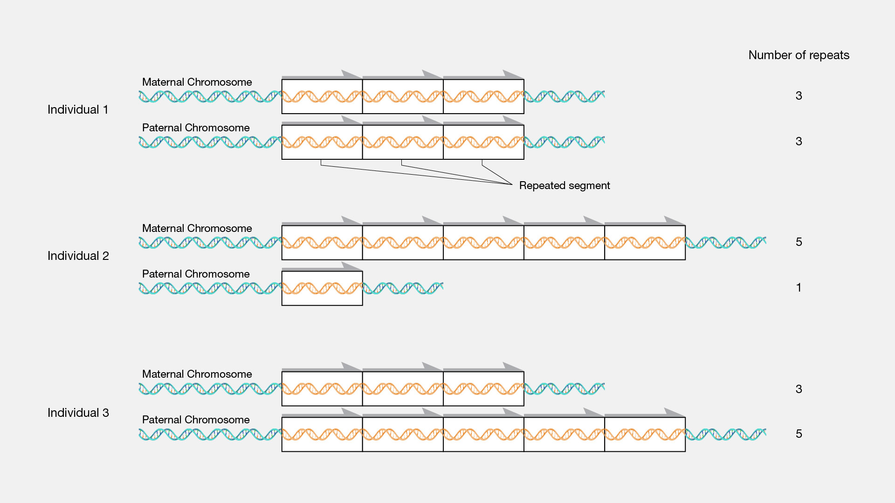

# Variations génétiques

!!! note
    À retenir avant tout : les substitutions, délétions, insertions ainsi que leurs
    conséquences.

## Types de variations

- **Substitution** ou Single Nucleotide Variant (SNV) : souvent improprement appelées
  SNP, elles correspondent au changement d'une base pour une autre.

> …CAG… → …C**T**G…

- **Déletion :** un ou plusieurs nucléotides sont manquants.

> …C**AT**G… → …CG…

- **Duplication :** une base est répétée une ou plusieurs fois.

> …CAG… → …CA**AA**G…

- **Insertion :** une ou plusieurs bases sont ajoutées, différentes de la base de
  référence.

> …CAG… → …CA**TC**G…

- **Inversion :** plusieurs nucléotides remplacent la séquence de réference par une
  séquence inversée.

> …CTCGA… → …C**GCT**A…

- **Délétion-insertion (delins) :** un ou plusieurs nucléotides sont remplacés par un ou
  plusieurs nucléotides sans être une substitution ou inversion. Le terme "indel"
  parfois entendu est considéré impropre.

> …CTC… → C**AGG**C… ou …CTGTC… → …C**A**C…

### En résumé

Ce que l'on pourrait observer dans un VCF :

```text
#CHROM	POS     ID	REF	ALT
chr1	2354	.	C	T	// Substitution
chr1	2485	.	C	TAC // Insertion
chr1	2444	.	TGA	C	// Deletion
chr1	2522	.	T	TTT	// Duplication
chr1	2556	.	CTA	ATC // Inversion
chr1	2782	.	C	ATG // Deletion-insertion
```

## Conséquences

Ces variations peuvent avoir différentes conséquences sur les codons servant à coder la
protéine.[^1]

- **Variation faux-sens :** appelée _missense_ en anglais, le codon obtenu code pour un
  autre acide aminé.

- **Variation non-sens :** appelée "nonsense *en anglais, le codon obtenu est un codon
  stop mettant fin à la transcription de l'ARN et produisant des transcrits tronqués.

- **Variation synonyme :** malgré la variation, l'acide aminé produit reste le même et
  l'impact sur le patient est virtuellement inexistant.

!!! example "Exemple"
    Le code génétique nous dit que :

      - TGT code pour une cystéine
      - TGC code pour une cystéine
      - TGA est un codon stop
      - TGG code pour un tryptophane

    Ainsi si la référence a pour séquence **TGT** :

      - le SNP TG**C** est une variation synonyme
      - le SNP TG**A** est une variation non-sens
      - le SNP TG**G** est une variation faux-sens

- **Frameshift** (ou décalage du cadre de lecture) : l'insertion ou la délétion d'un non
  multiple de trois entraîne une modification de tout le reste de la séquence et menant
  en général à un codon stop prématuré, ayant des conséquences de manière générale plus
  importantes que les autres types de variations.

!!! example "Exemple"
    Réference : -ATC-CGC-TGC-ACC-TGC-ACT-

    Exemple 1 : -ATC-**GCT-GCA-CCT-GCA-CTN-** // Frameshift due à la délétion d'une base

    Exemple 2 : -ATC-**TCC**-CGC-TGC-ACC-TGC-ACT- // Insertion de 3 bases = ajout d'un
    simple acide aminé

    Exemple 3 : -ATC-**GCT-GCC**-TGC-ACT- // Délétion d'une base puis deux réalignant le cadre
    de lecture

[^1]: cf [le code génétique](./dna.md)

### Cas particuliers des MNV

Lorsqu'il existe sur un même chromosome plusieurs variations proches, on parle de MNV
(Multi Nucleotide Variant). Cela peut cacher des conséquences plus graves que si l'on
observer chacune de ces variations individuellement.

!!! example "Exemple"
    - CUG code pour une Leu\
    variation en position 1 : C > U\
    UUG code toujours pour une Leu\
    ⇒ on peut se dire, c'est une variation synonyme, impact virtuellement inexistant

    - CUG code pour une Leu
    variation en position 3 : G > U
    CUU code toujours pour une Leu
    ⇒ même conclusion

    - Double variations en position 1 ET 3
    UUU code pour une Phe
    ⇒ l'acide aminé est modifié malgré ce qui semblait être deux variations synonymes

Faire savoir de manière pertinente à l'utilisateur lorsque ce type de situation se
produit peut faire la différence entre un diagnostic et une errance supplémentaire de
plusieurs années.

## Autres types de variations

!!! note
    Hors scope actuellement

### CNV

Pour copy number variation, cela correspond à des portions d'ADN généralement assez
longues, répétées et dont le nombre de répétitions est augmenté (duplications) ou
diminué (délétions).

](../images/cnv.jpg)](../images/cnv.jpg)

### STR variation

Pour short tandem repeat, correspond à un changement du nombre de répétition d'un court
fragment d'ADN type ACGACGACGACGACGACGACG…. Certaines maladies apparaissent lorsque ce
nombre de répétitions dépasse un certain seuil.
